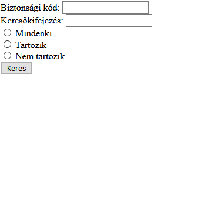

# PHP CsoportZH - Délelőtti csoport

## Fontos
Ha a webprogramozás szerveren teszteled a kódot, akkor a mappaszerkezeted így nézzen ki, ha eléred (pl. WinSCP-vel):  
`hallgatok\neptunkod\www\mappanev\almappanev`  
Tehát kerüljön bele minden egy *www* nevű mappába, amit böngészőből látni szeretnél!  
Viszont amikor ezt már ténylegesen böngészőből próbálod elérni, akkor a *www* mappanév kimarad, tehát a webcím így nézzen ki:  
`webprogramozas.inf.elte.hu/hallgatok/neptunkod/mappanev/almappanev`

**Jelezd Teams-en a chatbe, ha ezt a ZH-t írod, mert Canvasben be kell állítanom a láthatóságot!**

## Lore
A Magyar Nemkamu Bank úgy döntött, hogy szüksége van egy nagyon fejlett adminisztrációs programra, aminek segítségével listázhatja ügyfeleit, és az ő pénzügyeiket követheti. Az lenne a cél, hogy az adminisztratív alkalmazott rákereshessen egy-egy személy nevére, illetve szűrhessen aszerint, hogy egy adott ügyfélnek van-e tartozása.

## Feladat
Készíts PHP oldalt, melyen a következők találhatók:
- Legyen egy beviteli mező, amibe egy biztonsági kódot kell beírnunk
- Legyen egy beviteli mező, amibe keresőkifejezést lehet írni, mely alapján majd az ügyfelek nevére szűrünk
- Legyenek választógombok, amik segítségével eldönthető, hogy mely ügyfeleket szeretnénk listázni:
    - Mindenkit
    - Csak azokat, akiknek tartozásuk van (egyenlegük negatív)
    - Csak azokat, akiknek nincs tartozásuk (egyenlegük nem negatív)
- Legyen egy gomb, mely kattintásra egy táblázatba kiírja az oldalra az ügyfeleket keresési paraméterek szerint:
    - Biztonsági kód
        - Ha a biztonsági kód nincs megadva, akkor írjunk ki hibaüzenetet, és ne listázzuk az ügyfeleket
        - Ha a biztonsági kód nincs meg legalább 5 karakter hosszú, akkor írjunk ki hibaüzenetet, és ne listázzuk az ügyfeleket
        - Ha a biztonsági kód meg van adva, listázhatjuk az ügyfeleket (mindegy mi az értéke, azt majd ellenőrzi valami okos AI)
    - Keresőmező
        - Ha a beviteli mező üres, akkor ne szűrjön névre
        - Ha van beleírva valami, akkor csak azok az ügyfelek listázódjanak ki, akiknek a nevében benne van a keresőkifejezés
    - Választógombok
        - Ha egyik választógomb sincs kiválasztva, írjunk ki hibaüzenetet
        - Ha valamelyik ki van választva, annak megfelelően listázzuk az ügyfeleket
- Az oldal legyen állapottartó, ha rákerestünk valamire, az értékek maradjanak meg! (nem követelmény, hogy csak a helyes értékek maradjanak meg, de nem is gond, ha csak azok maradnak)

## Extra pont
Nem kötelező.  
- Listázásnál akinek negatív az egyenlege, az pirossal jelenjen meg, akinek pozitív, az zölddel, míg ha valaki pont nullán áll, azt sárgával.

## Példa



# Minta adatok

## PHP tömbbel
```php
[
    [
        "nev" => "Ávdolozó Péter",
        "egyenleg" => 420000
    ],
    [
        "nev" => "Brendó István",
        "egyenleg" => -69000
    ],
    [
        "nev" => "Gyorskocsi Viktor",
        "egyenleg" => 200100
    ],
    [
        "nev" => "Esidisi Béla",
        "egyenleg" => 1101
    ],
    [
        "nev" => "Jean-Pierre Nándor",
        "egyenleg" => 1138
    ],
    [
        "nev" => "Jónás-Csillag Gergő",
        "egyenleg" => -2187
    ],
    [
        "nev" => "Karsai Laura",
        "egyenleg" => -123456
    ],
    [
        "nev" => "Liza-Lizzi Júlia",
        "egyenleg" => 0
    ],
    [
        "nev" => "Noriáki Áron",
        "egyenleg" => 1821
    ],
    [
        "nev" => "Vamú Balázs",
        "egyenleg" => 1444
    ]
]
```

## JSON-nel
```json
{
    "ugyfelek": [
        {
            "nev" : "Ávdolozó Péter",
            "egyenleg" : 420000
        },
        {
            "nev" : "Brendó István",
            "egyenleg" : -69000
        },
        {
            "nev" : "Gyorskocsi Viktor",
            "egyenleg" : 200100
        },
        {
            "nev" : "Esidisi Béla",
            "egyenleg" : 1101
        },
        {
            "nev" : "Jean-Pierre Nándor",
            "egyenleg" : 1138
        },
        {
            "nev" : "Jónás-Csillag Gergő",
            "egyenleg" : -2187
        },
        {
            "nev" : "Karsai Laura",
            "egyenleg" : -123456
        },
        {
            "nev" : "Liza-Lizzi Júlia",
            "egyenleg" : 0
        },
        {
            "nev" : "Noriáki Áron",
            "egyenleg" : 1821
        },
        {
            "nev" : "Vamú Balázs",
            "egyenleg" : 1444
        }
    ]
}
```