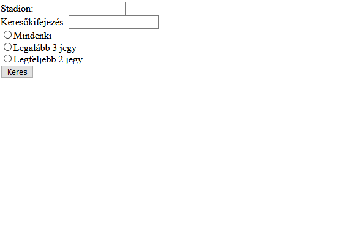

# PHP CsoportZH - Délutáni csoport

## Fontos
Ha a webprogramozás szerveren teszteled a kódot, akkor a mappaszerkezeted így nézzen ki, ha eléred (pl. WinSCP-vel):  
`hallgatok\neptunkod\www\mappanev\almappanev`  
Tehát kerüljön bele minden egy *www* nevű mappába, amit böngészőből látni szeretnél!  
Viszont amikor ezt már ténylegesen böngészőből próbálod elérni, akkor a *www* mappanév kimarad, tehát a webcím így nézzen ki:  
`webprogramozas.inf.elte.hu/hallgatok/neptunkod/mappanev/almappanev`

**Jelezd Teams-en a chatbe, ha ezt a ZH-t írod, mert Canvasben be kell állítanom a láthatóságot!**

## Lore
A Legendák Ligája világbajnokságon négy csapat jutott be a döntőbe, és mindenki mindenkivel fog játszani, ami hat meccset jelent. Ezeket a meccseket a világ hat nagy stadionjába szervezték, és minden stadion kapott egy kódot.
|Stadion                 |Kód|
|------------------------|---|
|Allianz Aréna           |AA |
|Gillette Stadion        |GS |
|Május Elseje Stadion    |MES|
|Camp Nou                |CN |
|Wembley                 |W  |
|Melbourne-i Krikettpálya|MK |
A szurkolók már nagyon izgatottak, és el is kezdték megvenni a jegyeket. A szervezőknek most szükségük van egy adminisztrációs szoftverre, hogy számon tarthassák, hányan vettek jegyet az egyes mérkőzésekre.

## Feladat
Készíts PHP oldalt, melyen a következők találhatók:
- Legyen egy beviteli mező, amibe egy stadion kódját kell beírnunk
- Legyen egy beviteli mező, amibe keresőkifejezést lehet írni, mely alapján majd a szurkolók nevére szűrünk
- Legyenek választógombok, amik segítségével eldönthető, hogy mely ügyfeleket szeretnénk listázni:
    - Mindenkit
    - Csak azokat, akiknek legalább 3 jegyük van
    - Csak azokat, akiknek kevesebb, mint 3 jegyük van
- Legyen egy gomb, mely kattintásra felsorolja az oldalra a szurkolókat keresési paraméterek szerint:
    - Stadion
        - Ha a stadion kód nincs megadva, akkor írjunk ki hibaüzenetet, és ne listázzuk a szurkolókat
        - Ha a stadion kód nem szerepel a stadion listában, írjunk ki hibaüzenetet, és ne listázzuk a szurkolókat
        - Ha a stadion kód meg van adva, listázhatjuk a szurkolókat
    - Keresőmező
        - Ha a beviteli mező üres, akkor ne szűrjön névre, hanem mindenkit listázzon ki
        - Ha van beleírva valami, akkor csak azok a szurkolók listázódjanak ki, akiknek a nevében benne van a keresőkifejezés
    - Választógombok
        - Ha egyik választógomb sincs kiválasztva, írjunk ki hibaüzenetet
        - Ha valamelyik ki van választva, annak megfelelően listázzuk a szurkolókat
- Az oldal legyen állapottartó, ha rákerestünk valamire, az értékek maradjanak meg! (nem követelmény, hogy csak a helyes értékek maradjanak meg, de nem is gond, ha csak azok maradnak)

## Extra pont
Nem kötelező.  
- Listázásnál akinek legalább 3 jegye van, az zöld színben jelenjen meg, akinek kevesebb, az pirossal.

## Példa



# Minta adatok

## PHP tömbbel
```php
[
    [
        "nev" => "Ávdolozó Péter",
        "stadionok" => ["AA","GS"]
    ],
    [
        "nev" => "Brendó István",
        "stadionok" => ["MES","W","MK"]
    ],
    [
        "nev" => "Gyorskocsi Viktor",
        "stadionok" => ["AA","CN","MK"]
    ],
    [
        "nev" => "Esidisi Béla",
        "stadionok" => ["CN","W"]
    ],
    [
        "nev" => "Jean-Pierre Nándor",
        "stadionok" => ["GS"]
    ],
    [
        "nev" => "Jónás-Csillag Gergő",
        "stadionok" => ["MES","CN","W"]
    ],
    [
        "nev" => "Karsai Laura",
        "stadionok" => ["MK","AA"]
    ],
    [
        "nev" => "Liza-Lizzi Júlia",
        "stadionok" => ["AA"]
    ],
    [
        "nev" => "Noriáki Áron",
        "stadionok" => ["MK","W","AA","CN"]
    ],
    [
        "nev" => "Vamú Balázs",
        "stadionok" => ["AA","GS"]
    ]
]
```

## JSON-nel
```json
{
    "szurkolok" : [
        {
            "nev" : "Ávdolozó Péter",
            "stadionok" : ["AA","GS"]
        },
        {
            "nev" : "Brendó István",
            "stadionok" : ["MES","W","MK"]
        },
        {
            "nev" : "Gyorskocsi Viktor",
            "stadionok" : ["AA","CN","MK"]
        },
        {
            "nev" : "Esidisi Béla",
            "stadionok" : ["CN","W"]
        },
        {
            "nev" : "Jean-Pierre Nándor",
            "stadionok" : ["GS"]
        },
        {
            "nev" : "Jónás-Csillag Gergő",
            "stadionok" : ["MES","CN","W"]
        },
        {
            "nev" : "Karsai Laura",
            "stadionok" : ["MK","AA"]
        },
        {
            "nev" : "Liza-Lizzi Júlia",
            "stadionok" : ["AA"]
        },
        {
            "nev" : "Noriáki Áron",
            "stadionok" : ["MK","W","AA","CN"]
        },
        {
            "nev" : "Vamú Balázs",
            "stadionok" : ["AA","GS"]
        }
    ]
}
```