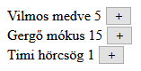
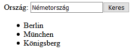

# 3. Gyakorlat feladatok
## 1. Feladat - Állatkert
### Lore
Megnyitotta kapuit a III. Kerületi Nemzeti Kisállatsimogató, ahova a fővárosi és vidéki famíliák közösen látogathatnak el, hogy honfitársakkal karöltve szemléljék meg a hazai fauna számos lélegzetelállító példányát. Az intézmény számon tartja, hogy egy-egy szőrmókra hányan voltak kíváncsiak, hogy a népszerűségi adatok alapján készíthessék el a megvásárolható játékfigurákat.

### Feladat
Az oldaladon legyenek felsorolva a simogatóban élő állatok. Mindegyükhöz tartozzon egy gomb és egy szám. A gomb megnyomására az említett szám növekedjen eggyel.

### Példa


### Induló kód
*Az induló kód csak javaslat, más megközelítést is használhattok.*
````JS
[
    {
        nev: 'Vilmos',
        faj: 'medve',
        latogatok: 5
    },
    {
        nev: 'Gergő',
        faj: 'mókus',
        latogatok: 15
    },
    {
        nev: 'Timi',
        faj: 'hörcsög',
        latogatok: 1
    }
]
````

## 2. Feladat - Boldog kis család
### Lore
Él egy rettentő boldog család, nem messze innen, ők a Habsváriak. A Habsvári család szereti járni Európát, és sok városban megfordultak már. Egyik ilyen utazásuk alatt azonban csúnya vitába keveredtek, ugyanis egy félreértés miatt Habsvári Ottóra mérges lett a felesége, a testvére és az unokatestvére. Hogy feszültségeiket feloldják, mindketten felfüggesztették szarajevói nyaralásukat, és új úti célt keresnek.

### Feladat
Készíts olyan JavaScript programot, ami segít megtalálni a Habsvári házaspárnak, hogy a keresett országon belül mely városokba utazhatnak vonattal.

### Példa


### Induló kód
*Az induló kód csak javaslat, más megközelítést is használhattok.*
````JS
[
    {
        varos: 'Berlin',
        orszag: 'Németország'
    },
    {
        varos: 'München',
        orszag: 'Németország'
    },
    {
        varos: 'Königsberg',
        orszag: 'Németország'
    },
    {
        varos: 'Franciaország',
        orszag: 'Párizs'
    },
    {
        varos: 'Egyesült Királyság',
        orszag: 'London'
    },
    {
        varos: 'Egyesült Királyság',
        orszag: 'Dublin'
    },
    {
        varos: 'Egyesült Királyság',
        orszag: 'Hong Kong'
    },
    {
        varos: 'Egyesült Királyság',
        orszag: 'Delhi'
    },
    {
        varos: 'Ausztria',
        orszag: 'Bécs'
    },
    {
        varos: 'Ausztria',
        orszag: 'Pozsony'
    },
    {
        varos: 'Ausztria',
        orszag: 'Budapest'
    },
    {
        varos: 'Moszkva',
        orszag: 'Oroszország'
    },
    {
        varos: 'Kijev',
        orszag: 'Oroszország'
    },
    {
        varos: 'Varsó',
        orszag: 'Oroszország'
    },
]
````