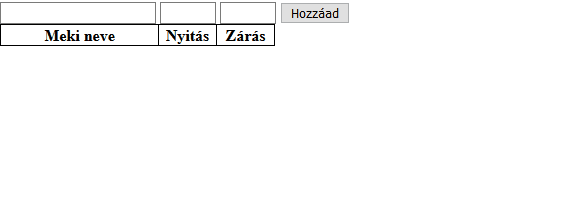
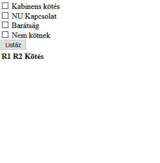

# 9. Gyakorlat feladatok
## 1. Feladat - Chickie Nuggie
### Lore
Gergőke nagyon szereti a McDonald's-ban kapható csirke nuggets falatokat. Sajnos mostanában a Mekik nyitva tartása ingadozó, és a Google sem ad mindig megbízható választ, így Gergőke szeretné összegyűjteni, hogy hol és mikor ehet McNuggets-et. Erre természetesen egy PHP alkalmazásra lesz szüksége, és mint legjobb barátja, te rögtön önként vállaltad a feladatot.

### Feladat
Készíts egy PHP oldalt, ahol egy űrlapon megadható egy McDonald's étterem neve, nyitási ideje, majd zárási ideje. A Meki neve nem lehet üres. Az időpont két szám egy kettősponttal elválasztva, előbbi 0-23, utóbbi 0-59. (A `split` függvény PHP-ben `explode(delimiter, string)`) Ha megadunk valamilyen adatokat, azt lehessen elmenteni. Az oldal betöltésekor az űrlap alatt jelenjen meg minden eddig hozzáadott étterem. A megoldáshoz ne használj JavaScriptet!

### Példa


## 2. Feladat - Kémia
### Lore
A részecskék kémiája egy nagyon izgalmas tudományág, mely rengeteg pontos számítást követel meg, emiatt nagy az igény a kémikus informatikusokra. Nagyon sok egyéb feladat mellett megoldásra vár az is, hogy az ELTE TTK mínusz negyedik emeletén található részecskékhez adminisztrációs programot készítsünk.

Adott néhány részecsketípus - mindegyiknek tudjuk a vegyjelét, tömegét (mértékegység: nemkamu gramm, Nkg), valamint hogy hány szabad elektronja van.
Két részecske között a következő kötések alakulhatnak ki:
- Kabinens Kötés: ha a tömegük egyezik, és mindkettőnek van szabad elektronja;
- NU Kapcsolat: ha a kettő tömege nem egyezik, de legfeljebb a tömegük átlagával térnek el egymástól, és mindkettőnek van szabad elektronja;
- Barátság: ha az egyik tömege legalább kétszerese a másiknak, és ugyanannyi szabad elektronjuk van (de legalább egy!);

Amennyiben egyik se teljesül, a két részecske nem fog egymáshoz kötődni. Ha két részecske NU Kapcsolattal és Barátsággal is tud kötni, akkor az erősebbet "választják", és mint tudjuk a Barátság a legerősebb kötelék.

### Feladat  
Listázd ki egy táblázatba az előre megadott részecskék minden lehetséges párosítását, és hogy azok hogyan fognak kötni! Egy részecskének az önmagával történő kötését is vizsgáld! Bár a részecskék sorrendje nem számít, attól még az R1 R2 és az R2 R1 pár is kerüljön be a táblázatba! A könnyebb átláthatóság érdekében a nem kötő pároknak a színe legyen fehér, a Kabinens Kötés kékes, a NU Kapcsolat zöldes, a Barátság pedig pirosas árnyalatú.  
Legyen négy jelölőmező, melyeket ha bejelölünk, csak az adott módon kötő (vagy negyedikként a nem kötő) párokat listázzuk! Egyszerre akár többet is lehessen kiválasztani, ekkor mindet listázzuk, ami ki van választva! Ha semmi nincs kiválasztva, semmi ne listázódjon!

### Példa


### Induló adatok
Az induló adatokat PHP asszociatív tömbök tömbjeként, PHP objektumok tömbjeként, és JS objektumok tömbjeként is megkapod, bármelyiket használhatod (de JavaScript kódot nem írhatsz).

#### Minta HTML
````HTML
<table>
    <tr>
        <th>R1</th>
        <th>R2</th>
        <th>Kötés</th>
    </tr>
    <tr>
        <td>Aa</td>
        <td>Aa</td>
        <td>Kabinens kötés</td>
    </tr>
    <tr>
        <td>Aa</td>
        <td>Ab</td>
        <td>Barátság</td>
    </tr>
    <tr>
        <td>Aa</td>
        <td>Ac</td>
        <td>Nem kötnek</td>
    </tr>
    <tr>
        <td>Aa</td>
        <td>Ad</td>
        <td>NU Kapcsolat</td>
    </tr>
</table>
````

#### PHP Asszociatív tömbök tömbje
````PHP
[
    [
        "vegyjel" => "Bt",
        "elektron" => 1,
        "tomeg" => 7
    ],
    [
        "vegyjel" => "Bv",
        "elektron" => 1,
        "tomeg" => 3
    ],
    [
        "vegyjel" => "Dd",
        "elektron" => 0,
        "tomeg" => 15
    ],
    [
        "vegyjel" => "Fa",
        "elektron" => 1,
        "tomeg" => 10
    ],
    [
        "vegyjel" => "Gv",
        "elektron" => 1,
        "tomeg" => 4
    ],
    [
        "vegyjel" => "Hh",
        "elektron" => 3,
        "tomeg" => 2
    ],
    [
        "vegyjel" => "Ip",
        "elektron" => 0,
        "tomeg" => 5
    ],
    [
        "vegyjel" => "Jk",
        "elektron" => 3,
        "tomeg" => 5
    ],
    [
        "vegyjel" => "Lm",
        "elektron" => 1,
        "tomeg" => 7
    ],
    [
        "vegyjel" => "Ml",
        "elektron" => 2,
        "tomeg" => 7
    ],
    [
        "vegyjel" => "Ng",
        "elektron" => 3,
        "tomeg" => 7
    ],
    [
        "vegyjel" => "Sn",
        "elektron" => 2,
        "tomeg" => 7
    ]
]
````

#### PHP objektumok tömbje
````PHP
[
    (object)[
        "vegyjel" => "Bt",
        "elektron" => 1,
        "tomeg" => 7
    ],
    (object)[
        "vegyjel" => "Bv",
        "elektron" => 1,
        "tomeg" => 3
    ],
    (object)[
        "vegyjel" => "Dd",
        "elektron" => 0,
        "tomeg" => 15
    ],
    (object)[
        "vegyjel" => "Fa",
        "elektron" => 1,
        "tomeg" => 10
    ],
    (object)[
        "vegyjel" => "Gv",
        "elektron" => 1,
        "tomeg" => 4
    ],
    (object)[
        "vegyjel" => "Hh",
        "elektron" => 3,
        "tomeg" => 2
    ],
    (object)[
        "vegyjel" => "Ip",
        "elektron" => 0,
        "tomeg" => 5
    ],
    (object)[
        "vegyjel" => "Jk",
        "elektron" => 3,
        "tomeg" => 5
    ],
    (object)[
        "vegyjel" => "Lm",
        "elektron" => 1,
        "tomeg" => 7
    ],
    (object)[
        "vegyjel" => "Ml",
        "elektron" => 2,
        "tomeg" => 7
    ],
    (object)[
        "vegyjel" => "Ng",
        "elektron" => 3,
        "tomeg" => 7
    ],
    (object)[
        "vegyjel" => "Sn",
        "elektron" => 2,
        "tomeg" => 7
    ]
]
````

#### JavaScript objektumok tömbje
````JS
[
    {
        "vegyjel" : "Bt",
        "elektron" : 1,
        "tomeg" : 7
    },
    {
        "vegyjel" : "Bv",
        "elektron" : 1,
        "tomeg" : 3
    },
    {
        "vegyjel" : "Dd",
        "elektron" : 0,
        "tomeg" : 15
    },
    {
        "vegyjel" : "Fa",
        "elektron" : 1,
        "tomeg" : 10
    },
    {
        "vegyjel" : "Gv",
        "elektron" : 1,
        "tomeg" : 4
    },
    {
        "vegyjel" : "Hh",
        "elektron" : 3,
        "tomeg" : 2
    },
    {
        "vegyjel" : "Ip",
        "elektron" : 0,
        "tomeg" : 5
    },
    {
        "vegyjel" : "Jk",
        "elektron" : 3,
        "tomeg" : 5
    },
    {
        "vegyjel" : "Lm",
        "elektron" : 1,
        "tomeg" : 7
    },
    {
        "vegyjel" : "Ml",
        "elektron" : 2,
        "tomeg" : 7
    },
    {
        "vegyjel" : "Ng",
        "elektron" : 3,
        "tomeg" : 7
    },
    {
        "vegyjel" : "Sn",
        "elektron" : 2,
        "tomeg" : 7
    }
]
````