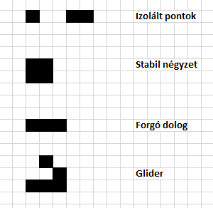
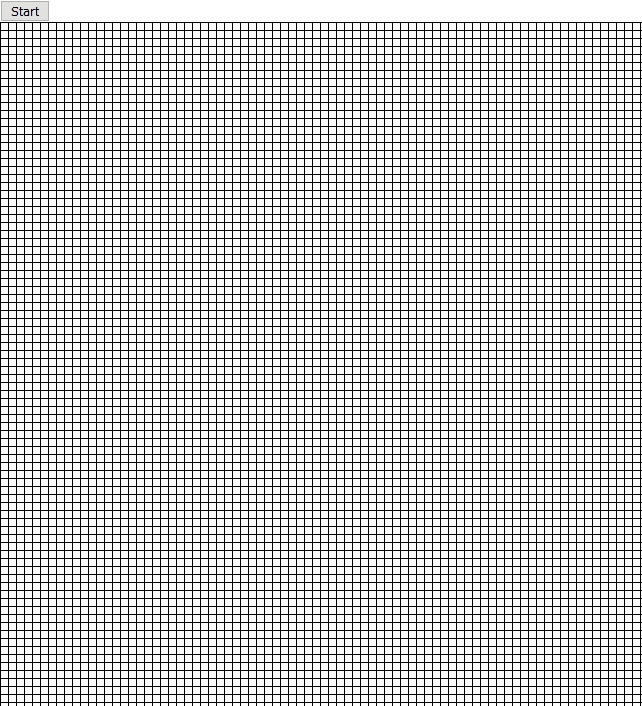

# Vizsgaidőszak JS szorgalmi
## Game of Life
### Lore
A Game of Life (Életjáték) John Horton Conway szüleménye. Valójában nem egy játék, inkább automata (érdekessége, hogy Turing-teljes), amiben a felhasználó megad egy kiinduló állapotot, és onnantól kezdve csak figyeli a fejleményeket.

A "játéktér" négyzetekből, ún. sejtekből áll, mindegyiknek két állapota van: él vagy halott. Minden sejtnek (a széleket leszámítva) nyolc szomszédja van, minden irányba egy (az eredeti példában a tábla végtelen, nincs széle, de azt most nehéz lenne HTML-ben szimulálni). A felhasználó a játék elején megadja, hogy melyik cellák éljenek, majd nyom egy start gombot, és elindul a szimuláció.

Az automatizált lefutás szabályai:
- Egy élő sejt tovább él, ha kettő vagy három élő szomszédja van.
- Egy sejt meghal, ha kettőnél kevesebb szomszédja van (izoláció miatt), vagy ha háromnál több (túlnépesedés miatt).
- Egy sejt megszületik (halottból élő lesz), ha pontosan három szomszédja él.

Fontos, hogy a folyamat körökre van osztva, és minden körben egyszer ellenőrizzük ezeket a feltételeket. Ha nem vennénk figyelembe, hogy a memória és a processzor kapacitása véges, el lehet úgy képzelni, hogy a régi tábla alapján megrajzolsz egy újat, és az egy kör.

### Feladat
Készítsd el a szimulációt egy legalább 100x100-as táblára. A felhasználó megadja a kiinduló állapotot, majd megnyomja a start gombot, és a szimuláció elindul. **Figyelj a számítási igényre! Ne ellenőrizz O(n*m) cellát csak azért, mert van 3 élő sejted épp! Figyelj arra, hogy elkerüld a memóriaszivárgást, vagyis ne tárolj exponenciálisan egyre több pontot egy-egy tömbben, mert kimarad egy `benne van?` feltétel egy `push` előtt!** Egy kör legyen például 500ms!

### Példa
Érdemes a következőket tesztelni:
- Egy izolált pont, illetve egy izolált pár azonnal eltűnik.
- Egy négy pontból álló négyzet stabil.
- Három egymás melletti pont csak forog.
- Egy `glider` (L alak és egy pont) elindul, és nem áll meg.

