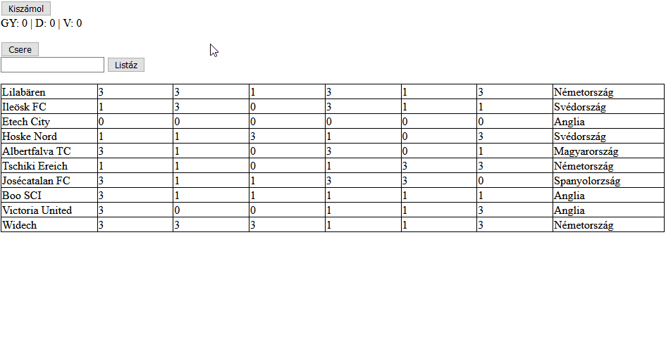

# CsoportZH
## 1. Feladat - Hajrá Fradi!

**OLVASD VÉGIG A FELADATOT, MIELŐTT NEKIKEZDESZ, HOGY EL TUDD DÖNTENI, MILYEN MÓDSZERREL FUTSZ NEKI**

### Lore
Most, hogy a Ferencváros kijutott a labdarúgó Bajnokok Ligája csoportkörébe, mindenki matematika professzorrá vált, és elkezdte az esélyeiket latolgatni. A legnagyobb kérdés, hogy milyen csapatokkal kerülnek egy csoportba a Zöld Sasok. A csapatok számos országból kerülhetnek ki, és minden csapat más-más erősségekkel bír, ezért alaposan fel kell készülnünk.

### Feladat
Legyen az oldalon egy táblázat, ami a lehetséges ellenfél csapatokat sorolja fel. Minden csapatról tudjuk a nevét, az elmúlt 6 meccsén szerzett pontjainak számát, és az országot, ahol a klub honos. Ha egy sorra rákattintunk, az legyen innentől kijelölve, ha újra rákattintunk, szűnjön meg a kijelölés.  
A táblázaton kívül a következő elemek találhatók az oldalon:
- Egy gomb, mely megnyomásra kiírja egy mellette található mezőbe, hogy a kijelölt csapatok összesen hány meccset nyertek, hány döntetlent játszottak és hányat vesztettek (a győzelmet 3 pont jelzi, a döntetlent 1, a vereséget 0).
- Egy gomb, melynek megnyomására a kijelölt sorokban minden győzelem vereséggé, és minden vereség győzelemmé változik. A döntetlenek változatlanok.
- Egy beviteli mező és egy gomb. A gombot megnyomva írjuk ki azoknak a kijelölt csapatoknak a nevét (tehát a kijelölésből válogatunk, nem pedig globálisan), akik a beírt országból származnak.


### Pontozás
- A listaelemek kattintással kijelölhetők, a kijelölt elemek kijelölése kattintással megszüntethető (2 pont)
    - Részpont: A kijelölés működik, de nem szüntethető meg (1.5 pont)
    - Valamilyen módon jelezd a kijelölést, például aláhúzással!
    - Ha az órán írt `delegal` függvényt használod, és működik, az +2 pont (de nem mehetsz 10 fölé)
    - *Tipp: A `delegal` függvényt itt találod: [Webprogramozas/20-21-1/3. Gyak/Delegalas/](https://github.com/gvikthor/Webprogramozas/tree/master/20-21-1/3.%20Gyak/Delegalas)*
- Az első gomb megnyomására a kijelölt csapatok győzelmei, döntetlenjei és vereségei összeszámolódnak, és kiírásra kerülnek a szomszédos elembe (2 pont)
    - Részpont: A kijelölés nem működik, viszont a script az összes csapatra kiszámolja egybe a győzelmek, döntetlenek és vereségek számát dinamikusan, tehát nem stringként beégetve a konkrét szám (1 pont)
    - Ha nincs senki kijelölve, az eredmény (ahogy a megszámlálás tételében is szerepel) három darab 0.
    - A győzelmet 3 pont, a döntetlent 1 pont, a vereséget 0 pont jelöli.
    - Ha a kijelölés pontosan egy csapatot érint, számold ki az egy meccsre jutó pontátlagukat +1 ZH pontért (de nem mehetsz 10 fölé)
    - *Tipp: Egy kijelölt sorban nem nehéz megtalálni a meccsek celláit, és azokkal közvetlen számolni, azonban kézenfekvőbb lehet valamilyen módon eltárolni a sorban (valamilyen adathalmazzal), hogy melyik adathoz tartozik az eredeti tömbünkben (mi az indexe), és onnan dolgozni. Amennyiben mégis előbbit alkalmazod, ne felejtsd el, hogy a HTML-ben csak szöveg tárolódik, számok soha.*
- A második gomb megnyomására a kijelölt sorokban minden győzelem átíródik vereséggé, és minden vereség átíródik győzelemmé (tehát 1->3 és 3->1). (3 pont)
    - Részpont: A kijelölés nem működik, viszont mindnekinek a győzelmei és vereségei módosulnak (1.5 pont)
    - *Tipp: Vegyük észre, hogy ha a meccsek celláit tekintjük csak, adott meccsek tömbben egy-egy szám ugyanannyiadik helyen van, mint ahányadik meccs cellába írtuk az adott soron belül. Mintha a meccsek celláit meg kéne jelölni valamivel, mert bár több van belőlük, ők bizony mind meccseredmények.*
- A harmadik gomb megnyomására kilistázódnak a kijelöltek közül azon csapatok nevei, melyek a beírt országból származnak. (3 pont)
    - Részpont: A kijelölés nem működik, viszont globálisan keresünk. (1.5 pont)
- Ha a táblázatot dinamikusan generálod ki, +1 pont (de nem mehetsz 10 fölé)
    - A táblázatot nem muszáj JavaScriptből generálni, azonban az eseménykezelőknek akkor is jól kell működni, ha a HTML-be égetett adatok számát változtatjuk.
    - Maga a `<table>` elem lehet a HTML-be írva, csak a tartalma legyen dinamikus a pluszponthoz. Ugyanígy a `button` elemeket se kell dinamikusan generálni, ha nem szeretnéd.

### Példa


### Visszajelzés

Ha végeztél a ZH-val, [ezen űrlapon keresztül](https://forms.office.com/Pages/ResponsePage.aspx?id=SLszAZD3YEWmTaxGpHL7vBhPmSkViFhMlGQ0CrcUApNUNEFPM0pRVkdTM1oxUkpMWU8yQUdJMU1XTy4u) tudod jelezni, hogy kb hány pontot értél el, és visszajelzést tudsz adni a nehézséggel kapcsolatban.

### Induló kód
````CSS
    table, tr, td, th{
        border: 1px solid black;
        border-collapse: collapse;
    }
    th{
        width: 10%;
    }
    td{
        width: 5%;
    }
````

````JS
[
    {
        nev: 'Lilabären',
        meccsek: [3,3,1,3,1,3],
        orszag: 'Németország'
    },
    {
        nev: 'Ileösk FC',
        meccsek: [1,3,0,3,1,1],
        orszag: 'Svédország'
    },
    {
        nev: 'Etech City',
        meccsek: [0,0,0,0,0,0],
        orszag: 'Anglia'
    },
    {
        nev: 'Hoske Nord',
        meccsek: [1,1,3,1,0,3],
        orszag: 'Svédország'
    },
    {
        nev: 'Albertfalva TC',
        meccsek: [3,1,0,3,0,1],
        orszag: 'Magyarország'
    },
    {
        nev: 'Tschiki Ereich',
        meccsek: [1,1,0,1,3,3],
        orszag: 'Németország'
    },
    {
        nev: 'Josécatalan FC',
        meccsek: [3,1,1,3,3,0],
        orszag: 'Spanyolorzság'
    },
    {
        nev: 'Boo SCI',
        meccsek: [3,1,1,1,1,1],
        orszag: 'Anglia'
    },
    {
        nev: 'Victoria United',
        meccsek: [3,0,0,1,1,3],
        orszag: 'Anglia'
    },
    {
        nev: 'Widech',
        meccsek: [3,3,3,1,1,3],
        orszag: 'Németország'
    }
]
````

