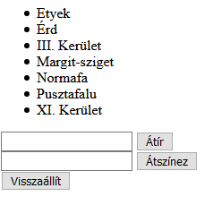

# Csoport mintaZH
## 1. Feladat - Virágszaglászás
### Lore
Egy baráti társaság összegyűjtötte azokat a helyszíneket, ahova gyakran járnak virágot szedni. Mivel a virágok gyönyörűsége néha megrészegíti őket, könnyen elfelejtik, hogy merre jártak már, így egy egyszerű adminisztrációs rendszert szeretnének készíteni hozzá, mert a Messenger csoportokból már kifejezetten elegük lett.

### Feladat
Legyen az oldalon egy lista, ami helyszíneket sorol fel. Ha rákattintunk egy elemre, az legyen innentől kijelölve, ha újra rákattintunk, szűnjön meg a kijelölés.  
A listán kívül a következő elemek találhatók az oldalon:
- Egy beviteli mező és egy gomb. A gombot megnyomva a kijelölt listaelemek tartalma átíródik a beviteli mező tartalmára.
- Még egy beviteli mező és gomb. Ha a beviteli mezőbe a kék/zöld/piros szöveget írják, a gomb megnyomására színezze át a kijelölt elemek hátterét az adott színre, minden más esetben hagyja változatlanul.
- Egy harmadik gomb, amit megnyomva a kijelölt elemek visszaállnak eredeti állapotba (szöveg és szín).

### Pontozás

- A listaelemek kattintással kijelölhetők, a kijelölt elemek kijelölése kattintással megszüntethető (2 pont)
    - Részpont: A kijelölés működik, de nem szüntethető meg (1.5 pont)
    - Valamilyen módon jelezd a kijelölést, például aláhúzással!
    - Ha az órán írt `delegal` függvényt használod, és működik, az +2 pont (de nem mehetsz 10 fölé)
- Az első gomb megnyomására a kijelölt elemek szövege megváltozik a beviteli mező értékére (3 pont)
    - Részpont: A kijelölés nem működik, viszont minden elem átíródik a beviteli mező értékére (1.5 pont)
- A második gomb megnyomására a kijelölt elemek színe megváltozik a beírt színnek megfelelően, hibás érték esetén pedig nem változik (3 pont)
    - Részpont: A kijelölés nem működik, viszont minden elem helyesen átszíneződik a beviteli mező értéke alapján (1.5 pont)
    - Részpont: A színválasztás nem működik, a gomb csak egy fix színre változtat, függetlenül attól, hogy a kijelölés működik-e (0.5 pont)
    - A beírható színek csak `kék`, `zöld` és `piros`, semmi másra ne működjön.
- A harmadik gomb megnyomására a kijelölt értékek és színek visszaállnak az eredetire (2 pont)
    - Részpont: A kijelölés nem működik, viszont minden elem visszaállítódik az eredeti értékére (1 pont)

### Példa


### Induló kód
````JS
[
    'Etyek',
    'Érd',
    'III. Kerület',
    'Margit-sziget',
    'Normafa',
    'Pusztafalu',
    'XI. Kerület'
]
````