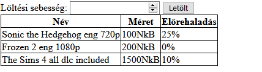
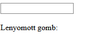
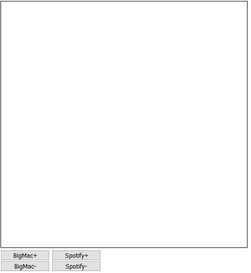

# JavaScript ÉvfolyamZH

## Tudnivalók

- A zárthelyi megoldására **120 perc** áll rendelkezésre.
- A feladatokat a Canvas rendszeren keresztül kell beadni. **A rendszer pontban 18:00-kor lezár, ezután nincs lehetőség beadásra**.
- A feladatok nem épülnek egymásra, **tetszőleges sorrendben** megoldhatók.
- A feladatokat **külön fileokba** készítsd el.  
  1. feladat: `f1.html`, `f1.js`  
  2. feladat: `f2.html`, `f2.js`  
  3. feladat: `f3.html`, `f3.js` 
  4. feladat: `f4.html`, `f4.js`  
- Egy külön `README.md` fájlban szerepeljen a következő kijelentés (a <> jeleket nem kell beleírni):
  ```
  <Név> 
  <Neptun ID> 
  <Tárgy & beadandó neve> 
  <Beküldés ideje> 
  Ezt a megoldást <Név, Neptun ID> küldte be és készítette a <Tárgy neve> kurzus Javascript Évfolyam ZH-jához.
  Kijelentem, hogy ez a megoldás a saját munkám. Nem másoltam vagy használtam harmadik féltől származó megoldásokat. Nem továbbítottam megoldást hallgatótársaimnak, és nem is tettem közzé. Az Eötvös Loránd Tudományegyetem Hallgatói Követelményrendszere (ELTE szervezeti és működési szabályzata, II. Kötet, 74/C. §) kimondja, hogy mindaddig, amíg egy hallgató egy másik hallgató munkáját - vagy legalábbis annak jelentős részét - saját munkájaként mutatja be, az fegyelmi vétségnek számít. A fegyelmi vétség legsúlyosabb következménye a hallgató elbocsátása az egyetemről.
  ```
- A `README.md` fájlban a kijelentés alatt egy üres sorral elválasztva szerepeljen az alábbi lista. Az egyes `[ ]` közötti szóközt cseréld le `x`-re azokra a részfeladatokra, amit sikerült (akár részben) megoldanod!
  ```md
  - 1. feladat
    + [ ] 1. részfeladat
    + [ ] 2. részfeladat
    + [ ] 3. részfeladat
  - 2. feladat
    + [ ] 1. részfeladat
    + [ ] 2. részfeladat
    + [ ] 3. részfeladat
    + [ ] 4. részfeladat
  - 3. feladat
    + [ ] 1. részfeladat
    + [ ] 2. részfeladat
    + [ ] 3. részfeladat
  - 4. feladat
    + [ ] 1. részfeladat
    + [ ] 2. részfeladat
    + [ ] 3. részfeladat
  ```

<div style="background: red; color: black; padding: 5px 10px;">
  <strong>A megfelelően kitöltött `README.md` fájl nélkül a megoldást nem fogadjuk el!</strong>
</div>

---

## 1. Feladat

### Lore

Mai tájékoztatóján az Operatív Törzs bejelentette, hogy a katonaság segítségével lezárja a magyarországi torrent klienseket - a cél az, hogy lassítsák a koronavírus terjedését az online felületeken keresztül is. Természetesen Te, mint tanult informatikus tudod, hogy a torrentekkel nem lehet vírust szerezni, hiszen nem hivatalos forrásból származó tartalmat nem tölt le senki, soha. Éppen ezért fogod magad, és megírod a saját torrent kliensedet, ami jobb lesz, mint az összes eddigi együtt!

### Feladat

Adott egy táblázat, ami a letöltéseinket tárolja. Minden letöltésnek van neve, mérete (NkB, NemkamuBit-ben megadva) és előrehaladása (százalékban).

```HTML
<table>
    <thead>
        <tr>
            <th>Név</th>
            <th>Méret</th>
            <th>Előrehaladás</th>
        </tr>
    </thead>
    <tbody>
        <tr>
            <td>Sonic the Hedgehog eng 720p</td>
            <td>100NkB</td>
            <td>25%</td>
        </tr>
        <tr>
            <td>Frozen 2 eng 1080p</td>
            <td>200NkB</td>
            <td>0%</td>
        </tr>
        <tr>
            <td>The Sims 4 all dlc included</td>
            <td>1500NkB</td>
            <td>10%</td>
        </tr>
    </tbody>
</table>
```

1) Legyen egy beviteli mező, amiben megadhatjuk a letöltési sebességet (NkB/s) és egy hozzá tartozó "Letölt" gomb.
2) A "Letölt" gomb megnyomására, írd ki a konzolra minden egyes torrenthez, hogy mekkora a mérete, és eddig mennyit töltött le a program belőle (NkB-ben).
3) A "Letölt" gomb megnyomására lépjen előre az összes letöltés a megadott NkB értékkel. Az előrehaladást továbbra is %-ban jelezd ki! Ha valamelyik letöltés elérte a 100%-ot, akkor az ne menjen tovább.


*A megoldás során ne használd ki, hogy ismered a torrentek mennyiségét (azaz a sorok számát), a script működjön akármennyi adatra!*



## 2. Feladat

### Lore

Az áprilisi zombiapokalipszisre készülve Magyarország egyik közintézménye elkezdte a stratégiai tartalékok felhalmozását. A beérkező szállítmányokat egy titkos XI. kerületi raktárba szállították, és a raktárat nagyon szépen rendszerezték. Egy zseniális ötlet alapján adatbázis kezelő rendszer helyett HTML-ben tárolták információkat, így most már csak egy javascript programra lenne szükség, amivel ezen adatok kezelhetők - és ezt a feladatot az intézmény neked delegálta.

### Feladat

Adott egy lista, ami tárolja a beérkezett szállítmányokat. Minden szállítmányról tudjuk, hogy mikor érkezett, milyen termékek jöttek (mégegy lista), és melyik polcra került.
```HTML
<style>
  .termek { background: lime; }
  .erkezes { font-weight: bold; }
  .polc { font-style: italic; }
</style>
<div id="adatok">
    <ul>
        <li class="szallitmany">
            <div>Érkezés: 2020.03.31.</div>
            <div>
                <ul>
                    <li>WC Papír</li>
                    <li>Kézfertőtlenítő</li>
                    <li>Szájmaszk</li>
                </ul>
            </div>
            <div>Polc: 2187</div>
        </li>
        <li class="szallitmany">
            <div>Érkezés: 2020.03.30.</div>
            <div>
                <ul>
                    <li>PureStar üdítőital</li>
                    <li>Savlekötő</li>
                </ul>
            </div>
            <div>Polc: 42</div>
        </li>
        <li class="szallitmany">
            <div>Érkezés: 2020.03.29.</div>
            <div>
                <ul>
                    <li>Haribo gumimedve</li>
                    <li>Smirnoff gyümölcskivonat</li>
                </ul>
            </div>
            <div>Polc: 501</div>
        </li>
    </ul>
</div>
```

1. Ha rákattintunk egy termékre (pl.: *Kézfertőtlenítő*), az adott listaelem váltson zöldre (alkalmazd rá a `.termek` stílusosztályt).
2. Ha rákattintunk az érkezésre (pl.: *Érkezés: 2020.03.29.*), akkor az egész szállítmány legyen vastagbetűs (alkalmazd rá a `.erkezes` stílusosztályt).
3. Ha rákattintunk a polcra (pl.: *Polc: 42*), akkor az egész szállítmány legyen dőltbetűs (alkalmazd rá a `.polc` stílusosztályt).
4. Ha megint rákattintunk a fentiek közül bármelyikre, tűnjön el az adott formázás (zöld, vastag vagy dőlt).

*A megoldás során ne használd ki, hogy ismered a szállítmányok mennyiségét (azaz a fő lista elemeinek számát), a script működjön akármennyi adatra! A megoldás során ne használj ciklust és iterátorokat az események hozzáfűzéséhez!*


## 3. Feladat

### Lore

A NATO minden tagállama figyelmét felhívta, hogy a május nem lesz könnyű, hiszen a klingon csillagflotta meg fogja támadni a Földet. Szerencsére a nemzetközi informátorok zsivány módon ellopták a támadás terveit, így lehetőségünk van felkészülni. Az agyafúrt tábornokaik azt találták ki, hogy meglepnek minket, és hamisítják az internet protokollt, melynek következtében a böngészők természetükből fakadóan klingon vírusoldalakra irányítanak. Mint az EU legjobb hekkere, te kaptad a feladatot, hogy megállítsd ezt az alapértelmezett viselkedést.

### Feladat

Adott egy input mező, amibe az IP cím írható.

```HTML
<style>
  .helytelen { box-shadow: 0 0 5px red; }
  .helyes    { box-shadow: 0 0 5px lime; }
</style>
<input>
```

1. Mivel a NATO elvárja a tökéletes precizitást, oldd meg, hogy a szövegmezőből a Backspace és a Del gomb segítségével ne lehessen törölni!
2. Oldd meg, hogy a szövegmezőbe csak az IP címhez szükséges karaktereket (szám vagy pont) lehessen írni.
3. Ha módosul a szövegmező tartalma, akkor ellenőrizd, hogy valóban IP cím formátumú-e a tartalma. (`[0-255].[0-255].[0-255].[0-255]`) Amennyiben a formátum megfelelő, alkalmazd a szövegmezőre a `.helyes` stílusosztályt, amennyiben hibás a formátum, legyen `.helytelen` stílusa.




## 4. Feladat

### Lore

A vírus, a zombik és a klingonok támadása után a június egy békésebb időszaknak ígérkezik, ezért lehetőségünk adódik reflektálni a történtekre. Az Emberi Erőforrások Minisztériuma szeretné egy grafikonon összegezni, hogy az elmúlt 50 napban hogyan változott a 2 legfontossabb gazdasági mutató az országban: a BigMac és a Spotify prémium ára (NkV, Nemkamu Valutában). Mivel te vagy az egyik legtehetségesebb művész, téged kértek meg, hogy vásznadat színesítsd az adatokkal.

### Feladat

Készíts egy felületet, ahol ezen két érték változásait lehet szemléltetni vonal grafikonnal. Tudjuk, hogy a BigMac alapára 250NkV, a Spotify előfizetésé 300NkV.
1. Legyen két gomb, ami a BigMac árát állítja. Ha a felfele gombra nyomunk, a BigMac ára a következő napra ugrik, és növekszik 10-el, a lefele gomb csökkenti 10-el. A BigMac színe piros.
2. Legyen két gomb, ami a Spotify előfizetés árát állítja. Ha a felfele gombra nyomunk, a Spotify ára a következő napra növekszik 10-el, a lefele gomb csökkenti 10-el. A Spotify színe zöld.
3. Ha bármelyik *görbe* meredeksége előjelet vált, írjuk ki az ottani értéket a grafikonra.

