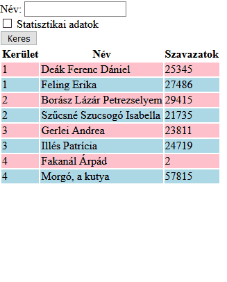

# CsoportZH
## 1. Feladat - Választás

**OLVASD VÉGIG A FELADATOT, MIELŐTT NEKIKEZDESZ, HOGY EL TUDD DÖNTENI, MILYEN MÓDSZERREL FUTSZ NEKI**

### Lore
Javaszkripsztán parlamentjében két párt verseng a szenátus vezetéséért. A Nemzeti Unió Közösülése (NUK) és a Köztársaság Csoportosult Sejk-Közössége (KCsSK). Mindkét párt indított jelöltet minden választókerületben, és szeretnénk megnézni, hogy hol ki nyert, és kik jutottak be a parlamentbe.

### Feladat
Listázd ki egy táblázatba az induló képviselőket. Legyen lehetőség névre keresni, és legyen lehetőség extra statisztikai adatokat is megtekinteni a választásokról.

Az induló kódban adott egy `tartalmaz` függvény, amit ha szeretnél, használhatsz a feladat megoldásához, esetleg módosíthatod is.
Az adatokat megtalálod lentebb az induló kódnál PHP asszociatív tömbök tömbjeként, PHP objektumok tömbjeként és JavaScript objektumként is. Ne használj JavaScriptet a feladat megoldásához (JSON-ön kívül).


### Olvass el!
A feladatokat nem kell sorban megcsinálni, sőt, az 5. feladatot érdemes a 3. és 4. előtt, mert könnyebb!

A feladatokat a webprogramozas.inf.elte.hu szerverend oldd meg, mert az ottani PHP verzióval fogom tesztelni. A szervert WinSCP-vel a legkönnyebb elérni, és az ottani www mappába helyezett tartalmat a webprogramozas.inf.elte.hu/hallgatok/neptunkod mappából éred el.

### Pontozás
1. **Adott egy listázás gomb, melynek megnyomásával kilistázódnak a képviselők nevei, pártjuk és választókerületük egy táblázatba. Adott képviselő sora a pártja függvényében más színű, például NUK pink, KCsSK lightblue.** (2 pont)
    - Részpont: A listázás megtörténik, de a színezés nem működik (1 pont)
    - *Ha a listázást file-ból teszed, nem pedig egy beégetett tömbből, +1 pont (de nem mehetsz 10 fölé)*

2. **Ha a névkereső mezőbe van valami írva, csak azok a képviselők listázódjanak, akiknek a neve tartalmazza a keresőkifejezést. Ha semmi nincs beírva, vagy csak szóközök, ne szűrj névre, listázz ki mindenkit.** (2.5 pont)
    - Részpont: Csak teljes névre lehet keresni, és pontos egyezést vizsgál. (1 pont)
    - *Ha keresésnél nem számít a kis és nagybetű, +1 pont (de nem mehetsz 10 fölé) - ezt akkor is megcsinálhatod, ha csak pontos névegyezést vizsgálsz, illetve nem probléma, ha speciális magyar karakterekre nem működik a kis/nagybetű*
     
3. **A táblázat mögé írd ki, hogy hány szavazatot kapott összesen a NUK, és hányat a KCsSK** (2 pont)
    - *Ha a számolás akárhány pártra működik, akármilyen nevekkel, +1 pont (Ezt a pluszpontot csak legalább 8 alap ponttal kaphatod meg, és az év végi pontokba számít be, nem a ZH-ba! Ha megcsináltad, azt jelezd a file elején kommenttel!)*

4. **A táblázat mögé írd ki egy listába (`ul` vagy `ol`), hogy az egyes választókerületekben melyik párt nyert, vagyis ki szerzett több szavazatot.** (2 pont)
    - Feltételezheted, hogy az adatok választókerület szerint rendezettek, és mindenhol pontosan két induló van, egy NUK-os és egy KCsSK-s. Azt is feltételezheted, hogy nincs szavazategyenlőség.
    - Részpont: Nem a nyertes pártot adod meg, hanem a kerületben a nyertes képviselőjelölt szavazatainak számát (1.5 pont)
    - *Ha a győzelem listázás akárhány pártra működne, akármilyen nevekkel, +1 pont (Ezt a pluszpontot csak legalább 8 alap ponttal kaphatod meg, és az év végi pontokba számít be, nem a ZH-ba! Ha megcsináltad, azt jelezd a file elején kommenttel!)*

5. **Az extra statisztikai adatok (előző két feladat) csak akkor íródjanak ki, ha a felhasználó bepipált egy jelölőnégyzetet, hogy ez érdekli őt** (1.5 pont)
    - Ha az előző két feladatot nem sikerült megcsinálni, akkor a jelölőnégyzet bepipálása esetén annyit írj ki a táblázat alá, hogy a statisztikai adatok nem elérhetőek.
    - Nem feltétel, hogy ha nincs bepipálva a mező, a program ne számolja ki azokat az adatokat, csak ne íródjanak ki.


### Példa


### Induló kód
Tartalmaz függvény
````PHP
function tartalmaz($nagyString, $eztTartalmazza){
    return strpos($nagyString, $eztTartalmazza) !== false;
    // PHP7-ben így kell használni, PHP8-ban már van rá szebb függvény
}
````

Adatok (PHP asszociatív tömbök tömbje)
````PHP
[
    [
        'kerulet' => 1,
        'nev'=> 'Deák Ferenc Dániel',
        'part'=> 'NUK',
        'szavazatok' => 25345
    ],
    [
        'kerulet' => 1,
        'nev'=> 'Feling Erika',
        'part'=> 'KCsSK',
        'szavazatok' => 27486
    ],
    [
        'kerulet' => 2,
        'nev'=> 'Borász Lázár Petrezselyem',
        'part'=> 'NUK',
        'szavazatok' => 29415
    ],
    [
        'kerulet' => 2,
        'nev'=> 'Szűcsné Szucsogó Isabella',
        'part'=> 'KCsSK',
        'szavazatok' => 21735
    ],
    [
        'kerulet' => 3,
        'nev'=> 'Gerlei Andrea',
        'part'=> 'NUK',
        'szavazatok' => 23811
    ],
    [
        'kerulet' => 3,
        'nev'=> 'Illés Patrícia',
        'part'=> 'KCsSK',
        'szavazatok' => 24719
    ],
    [
        'kerulet' => 4,
        'nev'=> 'Fakanál Árpád',
        'part'=> 'NUK',
        'szavazatok' => 2
    ],
    [
        'kerulet' => 4,
        'nev'=> 'Morgó, a kutya',
        'part'=> 'KCsSK',
        'szavazatok' => 57815
    ],
    [
        "kerulet" => 5,
        "nev"=> "Tóga Sárga Borbála",
        "part"=> "NUK",
        "szavazatok" => 27985
    ],
    [
        "kerulet" => 5,
        "nev"=> "Hentes Gabriella",
        "part"=> "KCsSK",
        "szavazatok" => 38954
    ],
    [
        "kerulet" => 6,
        "nev"=> "Nikolaszi Laura Daniella",
        "part"=> "NUK",
        "szavazatok" => 48641
    ],
    [
        "kerulet" => 6,
        "nev"=> "Donald Achillesz Ávdol",
        "part"=> "KCsSK",
        "szavazatok" => 24685
    ]
]
````


Adatok (PHP objektumok tömbje)
````PHP
[
    (object)[
        'kerulet' => 1,
        'nev'=> 'Deák Ferenc Dániel',
        'part'=> 'NUK',
        'szavazatok' => 25345
    ],
    (object)[
        'kerulet' => 1,
        'nev'=> 'Feling Erika',
        'part'=> 'KCsSK',
        'szavazatok' => 27486
    ],
    (object)[
        'kerulet' => 2,
        'nev'=> 'Borász Lázár Petrezselyem',
        'part'=> 'NUK',
        'szavazatok' => 29415
    ],
    (object)[
        'kerulet' => 2,
        'nev'=> 'Szűcsné Szucsogó Isabella',
        'part'=> 'KCsSK',
        'szavazatok' => 21735
    ],
    (object)[
        'kerulet' => 3,
        'nev'=> 'Gerlei Andrea',
        'part'=> 'NUK',
        'szavazatok' => 23811
    ],
    (object)[
        'kerulet' => 3,
        'nev'=> 'Illés Patrícia',
        'part'=> 'KCsSK',
        'szavazatok' => 24719
    ],
    (object)[
        'kerulet' => 4,
        'nev'=> 'Fakanál Árpád',
        'part'=> 'NUK',
        'szavazatok' => 2
    ],
    (object)[
        'kerulet' => 4,
        'nev'=> 'Morgó, a kutya',
        'part'=> 'KCsSK',
        'szavazatok' => 57815
    ],
    (object)[
        "kerulet" => 5,
        "nev"=> "Tóga Sárga Borbála",
        "part"=> "NUK",
        "szavazatok" => 27985
    ],
    (object)[
        "kerulet" => 5,
        "nev"=> "Hentes Gabriella",
        "part"=> "KCsSK",
        "szavazatok" => 38954
    ],
    (object)[
        "kerulet" => 6,
        "nev"=> "Nikolaszi Laura Daniella",
        "part"=> "NUK",
        "szavazatok" => 48641
    ],
    (object)[
        "kerulet" => 6,
        "nev"=> "Donald Achillesz Ávdol",
        "part"=> "KCsSK",
        "szavazatok" => 24685
    ]
]
````

Adatok (JSON)
````JS
[
    {
        "kerulet" : 1,
        "nev": "Deák Ferenc Dániel",
        "part": "NUK",
        "szavazatok" : 25345
    },
    {
        "kerulet" : 1,
        "nev": "Feling Erika",
        "part": "KCsSK",
        "szavazatok" : 27486
    },
    {
        "kerulet" : 2,
        "nev": "Borász Lázár Petrezselyem",
        "part": "NUK",
        "szavazatok" : 29415
    },
    {
        "kerulet" : 2,
        "nev": "Szűcsné Szucsogó Isabella",
        "part": "KCsSK",
        "szavazatok" : 21735
    },
    {
        "kerulet" : 3,
        "nev": "Gerlei Andrea",
        "part": "NUK",
        "szavazatok" : 23811
    },
    {
        "kerulet" : 3,
        "nev": "Illés Patrícia",
        "part": "KCsSK",
        "szavazatok" : 24719
    },
    {
        "kerulet" : 4,
        "nev": "Fakanál Árpád",
        "part": "NUK",
        "szavazatok" : 2
    },
    {
        "kerulet" : 4,
        "nev": "Morgó, a kutya",
        "part": "KCsSK",
        "szavazatok" : 57815
    },
    {
        "kerulet" : 5,
        "nev": "Tóga Sárga Borbála",
        "part": "NUK",
        "szavazatok" : 27985
    },
    {
        "kerulet" : 5,
        "nev": "Hentes Gabriella",
        "part": "KCsSK",
        "szavazatok" : 38954
    },
    {
        "kerulet" : 6,
        "nev": "Nikolaszi Laura Daniella",
        "part": "NUK",
        "szavazatok" : 48641
    },
    {
        "kerulet" : 6,
        "nev": "Donald Achillesz Ávdol",
        "part": "KCsSK",
        "szavazatok" : 24685
    }
]
````

### Visszajelzés

Ha végeztél a ZH-val, ezen az űrlapon keresztül tudod jelezni, hogy kb hogy sikerült, és visszajelzést tudsz adni a nehézséggel kapcsolatban: [Űrlap](https://forms.office.com/Pages/ResponsePage.aspx?id=SLszAZD3YEWmTaxGpHL7vBhPmSkViFhMlGQ0CrcUApNUNzNKN0g1TVcyTE5ROU5IWVlPSjIwMks2VS4u)