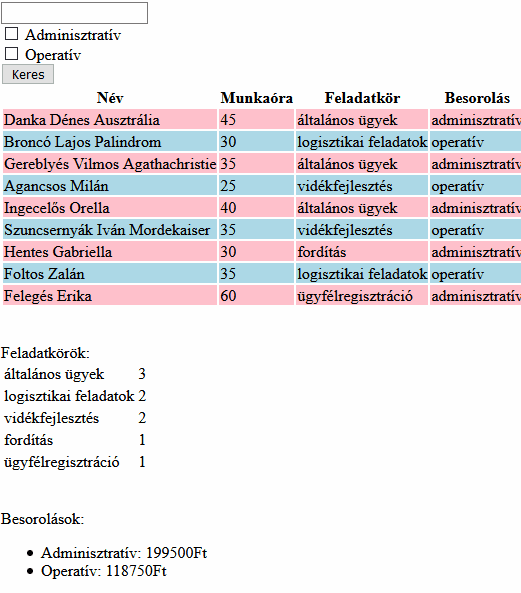

# CsoportZH
## 1. Feladat - Négyszögletű munkakörök

**OLVASD VÉGIG A FELADATOT, MIELŐTT NEKIKEZDESZ, HOGY EL TUDD DÖNTENI, MILYEN MÓDSZERREL FUTSZ NEKI**

### Lore
A Muttyanat cég rengeteg embert foglalkoztat, többek közt diákokat is. A diákok sokféle *feladatkörben* dolgozhatnak, de mindegyik besorolható két *kategóriába*: adminisztratív és operatív. Te nyerted el a Muttyanat cég közbeszerzési pályázatát, így Te készítheted el az új munkaügyi szoftverüket.

### Feladat
Adott egy adathalmaz, ami diákokat tárol. Minden diákról tudjuk, hogy a héten hány órát dolgozott, illetve megadják a hozzá tartozó feladatkört és besorolást is (tehát a feladatkör specifikus és sokféle, míg a besorolás vagy adminisztratív, vagy operatív). Listázd ki a diákokat, legyen lehetőség feladatkör nevére szűrni, illetve eldönteni, hogy milyen besorolású munkákat szeretnénk látni.


Az induló kódban adott egy `tartalmaz` függvény, amit ha szeretnél, használhatsz a feladat megoldásához, esetleg módosíthatod is.
Az adatokat megtalálod lentebb az induló kódnál PHP asszociatív tömbök tömbjeként, PHP objektumok tömbjeként és JavaScript objektumként is. Ne használj JavaScriptet a feladat megoldásához (JSON-ön kívül).

### Pontozás
- **Adott egy listázás gomb, melynek megnyomásával kilistázódnak a diákok egy táblázatba. Adott diák sora az aznapi munka besorolása függvényében más színű, például adminisztratív pink, operatív lightblue.** (2 pont)
    - Részpont: A listázás megtörténik, de a színezés nem működik (1 pont)
    - Az első listázás történhet az oldal első betöltésekor, a továbbiak a későbbi feladatok függvényében relevánsak.
    - *Ha a listázást file-ból teszed, nem pedig egy beégetett tömbből, +1 pont (de nem mehetsz 10 fölé)*

- **Ha a munkakereső mezőbe van valami írva, csak azok a diákok listázódjanak, akiknek a feladatköre (=/= besorolása) ráillik a keresési értékre (tehát a keresési érték benne van a feladatkör nevében). Például, ha a keresési érték graf, akkor a `digitális grafika` és `grafitpakoló` diákok is listázódjanak!** (2.5 pont)
    - Részpont: Csak teljes feladatkörre lehet keresni, és pontos egyezést vizsgálsz. (1 pont)
    - *Ha keresésnél nem számít a kis és nagybetű, +1 pont (de nem mehetsz 10 fölé) - ezt akkor is megcsinálhatod, ha csak pontos egyezést vizsgálsz, illetve nem probléma, ha speciális magyar karakterekre nem működik a kis/nagybetű*

- **Összesen mennyi pénzt költ a cég a diákmunkások béreire? Az adminisztratív feladatokért 950 forint jár óránként, az operatív feladatokért 1200** (2 pont)
    - Részpont: Mindkét besorolású feladat egységesen 1000 forint/óra (1 pont)

- **A táblázat mögé írd ki egy táblázatba, hogy egy-egy feladatkört hányan végeztek a héten.** (2 pont)
    - Részpont: Csak azt írod ki, hogy hányféle különböző feladatkör volt. (1.5 pont)
    - *Ha az elvégzők száma helyett az ledolgozott összórákat írod ki feladatonként, +1 pont (Ezt a pluszpontot csak legalább 8 alap ponttal kaphatod meg, és az év végi pontokba számít be, nem a ZH-ba! Ha megcsináltad, azt jelezd a file elején kommenttel!)*

- **Ha a felhasználó bepipált egy checkboxot, csak az adott besorolású munkák listázódjanak. Ha mindkettő be van pipálva, mindkettő listázódjon, ha egyik sincs, úgyszintén.** (1.5 pont)
    - *Ha az előző két feladatot is ennek a szűrésnek megfelelően számolod ki, +1 pont (Ezt a pluszpontot csak legalább 8 alap ponttal kaphatod meg, és az év végi pontokba számít be, nem a ZH-ba! Ha megcsináltad, azt jelezd a file elején kommenttel!)*


### Példa
**A gifen az operatív összeg rossz, a helyes: 150.000FT**





### Induló kód
Tartalmaz függvény
````PHP
function tartalmaz($nagyString, $eztTartalmazza){
    return strpos($nagyString, $eztTartalmazza) !== false;
    // PHP7-ben így kell használni, PHP8-ban már van rá szebb függvény
}
````

Adatok (PHP asszociatív tömbök tömbje)
````PHP
[
    [
        'nev' => 'Danka Dénes Ausztrália',
        'ora' => 45,
        'feladatkor' => 'általános ügyek',
        'besorolas' => 'adminisztratív'
    ],
    [
        'nev' => 'Broncó Lajos Palindrom',
        'ora' => 30,
        'feladatkor' => 'logisztikai feladatok',
        'besorolas' => 'operatív'
    ],
    [
        'nev' => 'Gereblyés Vilmos Agathachristie',
        'ora' => 35,
        'feladatkor' => 'általános ügyek',
        'besorolas' => 'adminisztratív'
    ],
    [
        'nev' => 'Agancsos Milán',
        'ora' => 25,
        'feladatkor' => 'vidékfejlesztés',
        'besorolas' => 'operatív'
    ],
    [
        'nev' => 'Ingecelős Orella',
        'ora' => 40,
        'feladatkor' => 'általános ügyek',
        'besorolas' => 'adminisztratív'
    ],
    [
        'nev' => 'Szuncsernyák Iván Mordekaiser',
        'ora' => 35,
        'feladatkor' => 'vidékfejlesztés',
        'besorolas' => 'operatív'
    ],
    [
        'nev' => 'Hentes Gabriella',
        'ora' => 30,
        'feladatkor' => 'fordítás',
        'besorolas' => 'adminisztratív'
    ],
    [
        'nev' => 'Foltos Zalán',
        'ora' => 35,
        'feladatkor' => 'logisztikai feladatok',
        'besorolas' => 'operatív'
    ],
    [
        'nev' => 'Felegés Erika',
        'ora' => 60,
        'feladatkor' => 'ügyfélregisztráció',
        'besorolas' => 'adminisztratív'
    ]
]
````


Adatok (PHP objektumok tömbje)
````PHP
[
    (object)[
        'nev' => 'Danka Dénes Ausztrália',
        'ora' => 45,
        'feladatkor' => 'általános ügyek',
        'besorolas' => 'adminisztratív'
    ],
    (object)[
        'nev' => 'Broncó Lajos Palindrom',
        'ora' => 30,
        'feladatkor' => 'logisztikai feladatok',
        'besorolas' => 'operatív'
    ],
    (object)[
        'nev' => 'Gereblyés Vilmos Agathachristie',
        'ora' => 35,
        'feladatkor' => 'általános ügyek',
        'besorolas' => 'adminisztratív'
    ],
    (object)[
        'nev' => 'Agancsos Milán',
        'ora' => 25,
        'feladatkor' => 'vidékfejlesztés',
        'besorolas' => 'operatív'
    ],
    (object)[
        'nev' => 'Ingecelős Orella',
        'ora' => 40,
        'feladatkor' => 'általános ügyek',
        'besorolas' => 'adminisztratív'
    ],
    (object)[
        'nev' => 'Szuncsernyák Iván Mordekaiser',
        'ora' => 35,
        'feladatkor' => 'vidékfejlesztés',
        'besorolas' => 'operatív'
    ],
    (object)[
        'nev' => 'Hentes Gabriella',
        'ora' => 30,
        'feladatkor' => 'fordítás',
        'besorolas' => 'adminisztratív'
    ],
    (object)[
        'nev' => 'Foltos Zalán',
        'ora' => 35,
        'feladatkor' => 'logisztikai feladatok',
        'besorolas' => 'operatív'
    ],
    (object)[
        'nev' => 'Felegés Erika',
        'ora' => 60,
        'feladatkor' => 'ügyfélregisztráció',
        'besorolas' => 'adminisztratív'
    ]
]
````

Adatok (JSON)
````JS
[
    {
        "nev" : "Danka Dénes Ausztrália",
        "ora" : 45,
        "feladatkor" : "általános ügyek",
        "besorolas" : "adminisztratív"
    },
    {
        "nev" : "Broncó Lajos Palindrom",
        "ora" : 30,
        "feladatkor" : "logisztikai feladatok",
        "besorolas" : "operatív"
    },
    {
        "nev" : "Gereblyés Vilmos Agathachristie",
        "ora" : 35,
        "feladatkor" : "általános ügyek",
        "besorolas" : "adminisztratív"
    },
    {
        "nev" : "Agancsos Milán",
        "ora" : 25,
        "feladatkor" : "vidékfejlesztés",
        "besorolas" : "operatív"
    },
    {
        "nev" : "Ingecelős Orella",
        "ora" : 40,
        "feladatkor" : "általános ügyek",
        "besorolas" : "adminisztratív"
    },
    {
        "nev" : "Szuncsernyák Iván Mordekaiser",
        "ora" : 35,
        "feladatkor" : "vidékfejlesztés",
        "besorolas" : "operatív"
    },
    {
        "nev" : "Hentes Gabriella",
        "ora" : 30,
        "feladatkor" : "fordítás",
        "besorolas" : "adminisztratív"
    },
    {
        "nev" : "Foltos Zalán",
        "ora" : 35,
        "feladatkor" : "logisztikai feladatok",
        "besorolas" : "operatív"
    },
    {
        "nev" : "Felegés Erika",
        "ora" : 60,
        "feladatkor" : "ügyfélregisztráció",
        "besorolas" : "adminisztratív"
    }
]
````