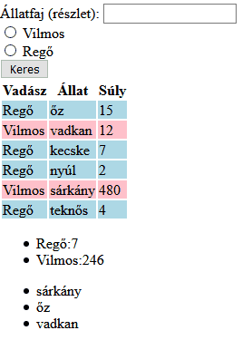

# CsoportZH
## 1. Feladat - Legendás Állatok és Étkeztetésük

**OLVASD VÉGIG A FELADATOT, MIELŐTT NEKIKEZDESZ, HOGY EL TUDD DÖNTENI, MILYEN MÓDSZERREL FUTSZ NEKI**

### Lore
Vilmos medve és Regő oroszlán úgy döntöttek, összeköltöznek, mert egy barlang fenntartása olcsóbb, mint kettőé. Az együttélés azonban azt is jelentette, hogy fel kell osztaniuk a napi vadászatot. Mivel ennek nyomonkövetése gyorsan ellehetetlenül primitív eszközökkel, a két jóbarát hozzád fordul, hogy írj nekik egy alkalmazást ezen tevékenységeik managelésére.

### Feladat
Adott egy adathalmaz, ami napokat tárol. Minden napról tudjuk, hogy aznap Vilmos, vagy Regő vadászott, hogy milyen állatot fogtak el, és az hány kilós volt. Listázd ki a napokat, legyen lehetőség elfogott állatfajra keresni, és legyen lehetőség további adatokat is megtekinteni a vadászatokról.


Az induló kódban adott egy `tartalmaz` függvény, amit ha szeretnél, használhatsz a feladat megoldásához, esetleg módosíthatod is.
Az adatokat megtalálod lentebb az induló kódnál PHP asszociatív tömbök tömbjeként, PHP objektumok tömbjeként és JavaScript objektumként is. Ne használj JavaScriptet a feladat megoldásához (JSON-ön kívül).

### Pontozás
- **Adott egy listázás gomb, melynek megnyomásával kilistázódnak a napok egy táblázatba. Adott nap sora az aznap vadászó függvényében más színű, például Vilmos pink, Regő lightblue.** (2 pont)
    - Részpont: A listázás megtörténik, de a színezés nem működik (1 pont)
    - Az első listázás történhet az oldal első betöltésekor, a továbbiak a későbbi feladatok függvényében relevánsak.
    - *Ha a listázást file-ból teszed, nem pedig egy beégetett tömbből, +1 pont (de nem mehetsz 10 fölé)*

- **Ha az állatkereső mezőbe van valami írva, csak azok a napok listázódjanak, melyeken fogtak el a keresési értékre ráillő állatot. Például, ha a keresési érték hal, akkor az aranyhal és a tőkehal is listázódjon!** (2.5 pont)
    - Részpont: Csak teljes állatfajra lehet keresni, és pontos egyezést vizsgálsz. (1 pont)
    - *Ha keresésnél nem számít a kis és nagybetű, +1 pont (de nem mehetsz 10 fölé) - ezt akkor is megcsinálhatod, ha csak pontos egyezést vizsgálsz, illetve nem probléma, ha speciális magyar karakterekre nem működik a kis/nagybetű*

- **A táblázat mögé írd ki egy listába (`ul` vagy `ol`), hogy mi volt a 3 legnehezebb elfogott állat fajtája. Ha néhány ugyanaz, akkor kiírhatod többször, nem kell összevonni.** (2 pont)
    - Részpont: Nem a legnehezebb állatok fajtáját adod meg, hanem csak a azok súlyát (1.5 pont)
    - Nem kell súly szerinti sorrendben kiírnod őket.
    - *Ha több azonos állat is van, de összevonod (pl. mindhárom legnagyobb állat őz, és te csak egy őz listaelemet generálsz), +1 pont (Ezt a pluszpontot csak legalább 8 alap ponttal kaphatod meg, és az év végi pontokba számít be, nem a ZH-ba! Ha megcsináltad, azt jelezd a file elején kommenttel!)*

- **A táblázat mögé írd ki (valamilyen rendezett módon), hogy egyenként átlagosan mekkora volt Vilmos, és mekkora volt Regő elfogott állatainak mértéke.** (2 pont)
    - Eldöntheted, hogy ez az állatszűrést számításba vegye, vagy ne.
    - *Ha a számolás akárhány barlanglakóra működne, akármilyen nevekkel, +1 pont (Ezt a pluszpontot csak legalább 8 alap ponttal kaphatod meg, és az év végi pontokba számít be, nem a ZH-ba! Ha megcsináltad, azt jelezd a file elején kommenttel!)*

- **Ha a felhasználó bepipált egy radio buttont, az átlagok (előző feladat) csak az adott lakóra (Vilmos vagy Regő) íródjanak ki** (1.5 pont)
    - Ha az előző feladatot nem sikerült megcsinálni, akkor egy-egy radio button bepipálása esetén annyit írj ki a táblázat alá, hogy a statisztikai adatok Vilmosról vagy Regőről (megfelelő gomb esetén a megfelelőt) nem elérhetőek.
    - Ha egyik sincs kipipálva, mindenkit írj ki!
    - Egyszerre legfeljebb csak az egyiküket lehessen bepipálni!
    - Nem feltétel, hogy ha nincs kiválasztva egyik gomb se, a program ne számolja ki azokat az adatokat, csak ne íródjanak ki.


### Példa



### Induló kód
Tartalmaz függvény
````PHP
function tartalmaz($nagyString, $eztTartalmazza){
    return strpos($nagyString, $eztTartalmazza) !== false;
    // PHP7-ben így kell használni, PHP8-ban már van rá szebb függvény
}
````

Adatok (PHP asszociatív tömbök tömbje)
````PHP
[
    [
        'vadasz'=> 'Regő',
        'allat'=> 'őz',
        'suly' => 15
    ],
    [
        'vadasz'=> 'Vilmos',
        'allat'=> 'vadkan',
        'suly' => 12
    ],
    [
        'vadasz'=> 'Regő',
        'allat'=> 'kecske',
        'suly' => 7
    ],
    [
        'vadasz'=> 'Regő',
        'allat'=> 'nyúl',
        'suly' => 2
    ],
    [
        'vadasz'=> 'Vilmos',
        'allat'=> 'sárkány',
        'suly' => 480
    ],
    [
        'vadasz'=> 'Regő',
        'allat'=> 'teknős',
        'suly' => 4
    ]
]
````


Adatok (PHP objektumok tömbje)
````PHP
[
    (object)[
        'vadasz'=> 'Regő',
        'allat'=> 'őz',
        'suly' => 15
    ],
    (object)[
        'vadasz'=> 'Vilmos',
        'allat'=> 'vadkan',
        'suly' => 12
    ],
    (object)[
        'vadasz'=> 'Regő',
        'allat'=> 'kecske',
        'suly' => 7
    ],
    (object)[
        'vadasz'=> 'Regő',
        'allat'=> 'nyúl',
        'suly' => 2
    ],
    (object)[
        'vadasz'=> 'Vilmos',
        'allat'=> 'sárkány',
        'suly' => 480
    ],
    (object)[
        'vadasz'=> 'Regő',
        'allat'=> 'teknős',
        'suly' => 4
    ]
]
````

Adatok (JSON)
````JS
[
    {
        "vadasz": "Regő",
        "allat": "őz",
        "suly" : 15
    },
    {
        "vadasz": "Vilmos",
        "allat": "vadkan",
        "suly" : 12
    },
    {
        "vadasz": "Regő",
        "allat": "kecske",
        "suly" : 7
    },
    {
        "vadasz": "Regő",
        "allat": "nyúl",
        "suly" : 2
    },
    {
        "vadasz": "Vilmos",
        "allat": "sárkány",
        "suly" : 480
    },
    {
        "vadasz": "Regő",
        "allat": "teknős",
        "suly" : 4
    }
]
````