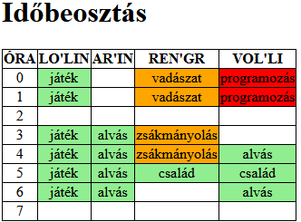
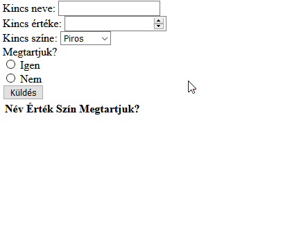
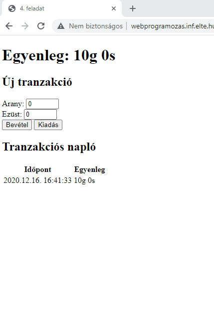

# PHP ÉvfolyamZH

## Tudnivalók

- A zárthelyi megoldására **120 perc** áll rendelkezésre. **További 30 perc**et adunk az alább olvasható `README.md` fájl kitöltésére, a feladatok elolvasására, az anyagok letöltésére, összecsomagolására és feltöltésére.
- A feladatokat a Canvas rendszeren keresztül kell beadni. **A rendszer pontban 18:30-kor lezár, ezután nincs lehetőség beadásra**.
- A feladatok megoldásához **bármilyen segédanyag használható** (dokumentáció, előadás, órai anyag, cheat sheet, Google). A zh időtartamában igénybe vett **emberi segítség tilos** (szinkron, aszinkron, chat, fórum, stb)! Erről nyilatkozol az alább olvasható `README.md` fájlban is, ahol tudomásul veszed ennek következményeit.
- A feladatok nem épülnek egymásra, **tetszőleges sorrendben** megoldhatók.
- A feladatok megoldásához először [töltsd le az általunk készített keretprogramot](???). Ebben minden feladat külön könyvtárban helyezkedik el. Minden könyvtárban előkészítettük a feladatokat valamilyen mértékben. Ezeken kívül természetesen használhatsz más fájlokat is az adatok tárolására, a kódod további szervezésére, illetve a szerveroldali AJAX/Fetch funkcionalitás megvalósítására, de az alább megadott 4 néven kell hogy elérhetők legyenek a megoldásaid.
  ```
  1. feladat: 1/index.php
  2. feladat: 2/index.php
  3. feladat: 3/index.php
  4. feladat: 4/index.php
  ```
- A letöltött keretprogramban lévő `README.md` fájlban töltsd ki a neved és a Neptun azonosítódat (a <> jeleket nem kell beleírni)! **A megfelelően kitöltött `README.md` fájl nélkül a megoldást nem fogadjuk el!**
  ```
  <Hallgató neve> 
  <Neptun kódja> 
  <Tárgy neve> - PHP évfolyam ZH
  2020.12.18.
  Ezt a megoldást <Hallgató neve, Neptun kódja> küldte be és készítette a <Tárgy neve> kurzus PHP évfolyam ZH-jához.
  Kijelentem, hogy ez a megoldás a saját munkám. Nem másoltam vagy használtam harmadik féltől származó megoldásokat. Nem továbbítottam megoldást hallgatótársaimnak, és nem is tettem közzé. Az Eötvös Loránd Tudományegyetem Hallgatói Követelményrendszere (ELTE szervezeti és működési szabályzata, II. Kötet, 74/C. §) kimondja, hogy mindaddig, amíg egy hallgató egy másik hallgató munkáját - vagy legalábbis annak jelentős részét - saját munkájaként mutatja be, az fegyelmi vétségnek számít. A fegyelmi vétség legsúlyosabb következménye a hallgató elbocsátása az egyetemről.
  ```
- Minden feladat könyvtárában találsz egy `TASKS.md` fájlt. Ezekben az egyes `[ ]` közötti szóközt cseréld le `x`-re azokra a részfeladatokra, amiket sikerült (akár részben) megoldanod! Ez segít nekünk abban, hogy miket kell néznünk az értékeléshez.


## 1. feladat: Időbeosztás

A goblinok kitervelték, hogy el fogják lopni a Kobold Királyság kincseit. Egy baj van: nem tudják, hogy mikor lesz erre idejük. Készítsünk el egy olyan oldalt, amely megjeleníti az egyes goblinok napi elfoglaltságait! (A goblinok élete egyébként nagyon unalmas, minden napjuk egyformán telik.) **A kódolás megkezdése előtt érdemes tanulmányozni és megérteni az `1/index.php` fájlban megadott adatok szerkezetét!**

- a. (2 pont) Az elfoglaltságokat jelenítsd meg egy táblázatban, amelynek első sorában a goblinok nevei legyenek feltüntetve! (Ezek a `$goblins` asszociatív tömb kulcsai.)
- b. (2 pont) A goblinok az időt napkeltétől napnyugtáig számítják nyolc órára bontva. Napkeltekor kezdődik a 0. óra, a nap pedig pontosan 7:59-kor nyugszik. Ennek megfelelően jelenítsük meg a táblázat első oszlopában a számokat 0-tól 7-ig!
- c. (2,5 pont) Az egyes goblinok tevékenységéről a következőket tudjuk: melyik órában végzi (`startHour`), mi a tevékenység azonosítója (`activityKey`). Minden tevékenység egy órás. Magukat a tevékenységeket azok nevével és nehézségével egy külön `$activities` tömb tartalmazza. Ha az oszlopban lévő goblinnak a sorral jelzett órában van tevékenysége, írjuk a cellába a tevékenység nevét!
- d. (1,5 pont) A tevékenységek nehézségét egy 0-tól 1-ig terjedő valós skálán mérik. Színezzük a 0.5-ös és annál kisebb nehézségű tevékenységek celláinak hátterét világoszöldre (`lightgreen`), 0.5 fölött 0.8-ig narancssárgára (`orange`), 0.8 fölött pirosra (`red`)! Ahol nincs tevékenység, a cella maradjon fehér hátterű!

### Példa kimenet (más adatokkal)


## 2. Feladat: Munkaszervezés

A goblinok meg akarják tervezni, hogyan fogják ellopni a Kobold Király kincseit. A következőkre lesz szükségük:
- Munkás goblinokra.
- A munkások vezetőjének a nevére, ami a nevéből és rangjából áll.
- Legalább annyi ásóra, ahány goblint visznek, de lehetőleg kétszer annyira.

Ez alapján készíts egy olyan oldalt (`2/index.php`), ahol az URL-ben paraméterként megadható (`index.php?goblins=5&chief=Snuch Nawdow nagyfőnök&shovels=7`), hogy
- hány munkás goblin érkezik (`goblins`, ez egy szám, pl.: 17),
- ki lesz a munkások vezetője (`chief`, ez egy szöveg legalább egy szóközzel, de az utolsó elem mindig a goblin rangja, pl.: Snuch Nawdow nagyfőnök)
- hány ásója lesz a goblinoknak (`shovels`, ez egy szám, pl.: 26).

Az oldal a következőket írja ki a különböző bemenetekre:
- a. (2 pont) Amennyiben a `goblins` paraméter nem létezik, nem szám, nem egész, vagy nem pozitív: `Érvénytelen goblin mennyiség!`
- b. (1,5 pont) Amennyiben a `chief` paraméter nem létezik, vagy nincs benne legalább egy szóköz: `Érvénytelen vezető!`
- c. (2 pont) Amennyiben a vezető rangja nem szerepel a goblin rangok közt: `Érvénytelen rang!`, ha pedig nem éri el a `nagyfőnök` szintet: `Túl alacsony rang!`
    - A goblin rangok (legkisebbtől legnagyobbig):
    ```
        goblinka, kisfőnök, nagyfőnök, főfőnök, törzsfő
    ```
- d. (1,5 pont) Amennyiben a `shovels` paraméter nem létezik, nem szám, nem egész, vagy negatív: `Érvénytelen ásó mennyiség!`, ha pedig kisebb, mint a goblinok száma: `Túl kevés ásó!` (ez utóbbit elég akkor megnézni, ha az ásók száma érvényes volt)
- e. (1 pont) Ha minden paraméter megfelelő: `Indulhat az akció!`, ha pedig legalább kétszer annyi ásó van, mint goblin: `Gyorsan megszerezzük a kincset!`

### Példa bemenet-kimenet párok
```
url: index.php?goblins=5&chief=Snuch Nawdow nagyfőnök&shovels=7
kimenet:
- Indulhat az akció!

url: index.php?goblins=5&chief=Snuch Nawdow nagyfőnök&shovels=10
kimenet:
- Gyorsan megszerezzük a kincset! 

url: index.php
kimenet:
- Érvénytelen goblin mennyiség!
- Érvénytelen vezető!
- Érvénytelen ásó mennyiség!

url: index.php?goblins=nemszám&chief=nincsszóköz&shovels=nemszám
kimenet:
- Érvénytelen goblin mennyiség!
- Érvénytelen vezető!
- Érvénytelen ásó mennyiség!

url: index.php?goblins=-5&chief=Snuch Nawdow nagyfőnök&shovels=10
kimenet:
- Érvénytelen goblin mennyiség!

url: index.php?goblins=16.2&chief=Snuch Nawdow nagyfőnök&shovels=10
kimenet:
- Érvénytelen goblin mennyiség!

url: index.php?goblins=16&chief=Snuch Nawdow nagyfőnök&shovels=10
kimenet:
- Túl kevés ásó!

url: index.php?goblins=5&chief=Snuch Nawdow párttitkár&shovels=10
kimenet:
- Érvénytelen rang!

url: index.php?goblins=5&chief=Snuch Nawdow kisfőnök&shovels=10
kimenet:
- Túl alacsony rang!
```
*Ezek a bemenet-kimenet párok példák, nem elég, ha csak ezekre működik helyesen!*


## 3. feladat: Nyilvántartás

A goblinok megszerezték a Kobold Király kincseit, és most kategorizálni szeretnék őket egy űrlap segítségével, melyen a következőket lehet megadni:
- Adott kincs nevét (szöveg).
- Adott kincs értékét (szám).
- Adott kincs színét (legördülő lista, `piros`, `narancs`, `sárga`, `zöld`, `kék`, `lila` értékekkel)
- Adott kincset megtartják, vagy eladományozzák (rádiógombok)

Feltételezheted, hogy az űrlapba beírt adatok helyesek, viszont a tároláskor figyelj arra, hogy megfelelő típusú adatokat ments el (szám típust számként, logikait logikaiként stb.)!

- a. (1 pont) Az oldalra érkezve jelenjen meg egy űrlap, amely minden szükséges mezőt tartalmaz!
- b. (1,5 pont) Az űrlapot helyesen kitöltve mentsd el a felküldött adatokat típushelyesen (szám, logikai) egy fájlba! Sikeres mentés után újra jelenjen  meg az űrlap!
- c. (1,5 pont) Az űrlap alatt listázódjanak az eddigi kincsek minden adatukkal. Ez a lista/táblázat minden oldalbetöltéskor jelenjen meg, azaz akkor is, amikor először érkezünk az oldalra, és akkor is, amikor az űrlapot elküldtük és adatait sikeresen mentettük!
- d. (2 pont) Egy-egy kincset lehessen törölni a lista soraiban megjelenített "Töröl" linkre kattintva! 
- e. (2 pont) Oldjuk meg, hogy ha az űrlapon már létező nevű kincset adunk meg, csak frissítsük annak adatait, ne adjuk hozzá újra!

### Így működjön



## 4. feladat: Goblinkassza

Néhány goblinra a Kobold Királyság kincseinek megszerzése után még várt egy feladat: a megszerzett zsákmány értékes részét elárverezték, majd az ebből származó bevételt a goblinpénztárosok elkönyvelték. Ezt a könyvelést segítő alkalmazást kell most megírni. A goblinok pénzegysége az arany (jele: g), amelyet további 12 ezüstre (jele: s) bontunk. A kincstár számlaegyenlegét **munkamenetben** tárold! Amennyiben nincs még munkamenet, a kezdő egyenleg legyen *10g 0s*. A tranzakciókat egy, az oldalon megjelenő táblázatban naplózzuk.
- a. (1 pont) Az oldal betöltésekor (és minden újratöltéskor) jelenjen meg ez a táblázat, és (a fejlécen kívül) egy sort tartalmazzon: a betöltés időpontját és a kezdőegyenleget. (Figyelem! A kezdőegyenleg nem minden betöltéskor *10g 0s*, ugyanis korábban már létrejöhetett a munkamenet és megváltoztathattuk a későbbi feladatokban. Ld. következő feladatok!)
- b. (1,5 pont) Az oldalon található *Bevétel* gombra kattintva az **oldal újratöltése nélkül** érd el, hogy az egyenleg megnövekedjen a beírt arany és ezüst értékkel! **Minden adatfeldolgozást szerver oldalon kell végezni és AJAX/fetch segítségével megoldani az adatcserét a kliens- és szerver között!** (A módosított egyenleg kiírását ld. az e. pontban!)
- c. (1 pont) Az aritmetika működjön a pénznem szabályainak megfelelően, tehát az ezüstök száma mindig 0..11 halmazba essen! Például: `1g 3s + 2g 10s = 4g 1s`.
- d. (1,5 pont) Az oldalon található *Kiadás* gombra kattintva vondd le a megadott összeget az egyenlegből! Amennyiben az így kapott összeg negatív lenne, ne hajtsd végre a tranzakciót (maradjon változatlan az egyenleg)! (A módosított egyenleg kiírását ld. az e. pontban!)
- e. (1,5 pont) Minden bevételkor vagy kiadáskor bővítsd a táblázatot egy sorral, amely az aktuális időpontot és a tranzakció utáni egyenleget tartalmazza! **Ezeket az adatokat is szerverről vedd, csak a kiírást végezd JavaScriptben!**
- f. (1,5 pont) Ha a tranzakció nem változtatott az egyenlegen, a táblázatban ne jelenjen meg új sor! (Ilyen akkor történhet, ha a kiadás nagyobb lenne, mint a teljes egyenleg; vagy *0g 0s*  a bevétel/kiadás.)

### Így működjön

