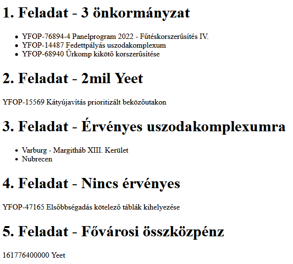

# CsoportZH

## Technikai infók
A feladat megoldására 45 perc áll rendelkezésre, plusz 5 perc kifejezetten a becsomagolásra és elküldésre. Egy tömörített file-t küldjetek emailben a **mohmas@inf.elte.hu** címre, tárgy **[Web] CsoportZH - *Neptun-kódod*** (pl.: [Web] CsoportZH - MOHMAS). A szögletes zárójelek is legyenek a tárgyban, mert így biztosan a külön erre fenntartott mappába érkezik, nem pedig spambe, kukába stb (volt már rá példa sajnos). A js file kiterjesztését írjátok át, nehogy a levelezőrendszer megfogja, tehát script.js helyett legyen például script.js.txt vagy script.txt.

## Lore
Yavaszkripsztán önkormányzatai pályázatok (projektek) keretei közt igyekeznek fejlesztésekhez jutni. Minden pályázatnak ismerjük a nevét, az arra szánt erőforrásokat (Yavaszkripsztán valutája a `Yeet`), illetve a pályázat jellegét, mely lehet `infrastruktúra fejlesztés` vagy `közterületi beruházás`. Az infrastruktúra fejlesztéseknek van egy-egy korlátja, ami megmondja, minimum hány embert kell érintenie a projektnek. A közterületi beruházásoknál minimális befogadóképesség van megadva.

Minden pályázatról tudjuk, hogy mely önkormányzatok pályáztak rá. Mindegyiknek van neve, valamint infrastruktúra fejlesztés esetén megadják az érintett lakosok számát, közterületi beruházás esetén pedig a tervezett befogadóképességet.

**Szánj időt az induló adatok értelmezésére, amik a kiinduló kódban adottak!**

## Feladatok
A projekteket és az önkormányzatokat a nevükkel kell megadni (`nev` illetve `onkormanyzat`). Olvasd végig a feladatokat, mielőtt nekik futsz!

### 1. Feladat (1 pont)
Listázd ki azokat a projekteket, amikre legalább 3 önkormányzat pályázott!

### 2. Feladat (1 pont)
Adj meg egy projektet, aminek a költségvetése (rászánt erőforrás mértéke) eléri a kétmillió Yeet-et! **Ne feltételezd**, hogy létezik ilyen - ha ez áll fenn, írd ki, hogy nincs ilyen pályázat.

### 3. Feladat (2 pont)
Listázd ki azokat az önkormányzatokat, akik érvényes pályázatot adtak le a `YFOP-14487 Fedettpályás uszodakomplexum` projektre! Ez egy közterületi beruházás, tehát a pályázat akkor érvényes, ha a tervezett közterület befogadóképessége eléri a pályázatban meghatározott minimumot. **Feltételezheted**, hogy létezik ilyen nevű pályázat.

### 4. Feladat (2 pont)
Adj meg egy infrastruktúra fejlesztést, melyre nem érkezett be érvényes pályázat (egyik pályázó önkormányzat lakossága sem éri el az érintettek szükséges minimumát). **Feltételezheted**, hogy létezik ilyen!

### 5. Feladat (4 pont)
Mekkora az összértéke azon projekteknek, melyekre pályázott (legalább egy) fővárosi önkormányzat? A fővárosi önkormányzat onnan ismerhető fel, hogy nevében szerepel a `Varburg` szó.

### 1. Bónusz (1 pont)
A megoldások ne számolódjanak/íródjanak ki helyből, csak egy gomb megnyomására (egyszerre az összes)!

### 2. Bónusz (1 pont)
Minden feladatnak legyen külön saját gombja, ami csak azt a feladatot oldja meg/írja ki!

### 3. Bónusz (1 pont)
Minden feladatnak legyen külön saját gombja, de egyetlen eseménykezelőt használj (delegálás)!

## Megoldás
