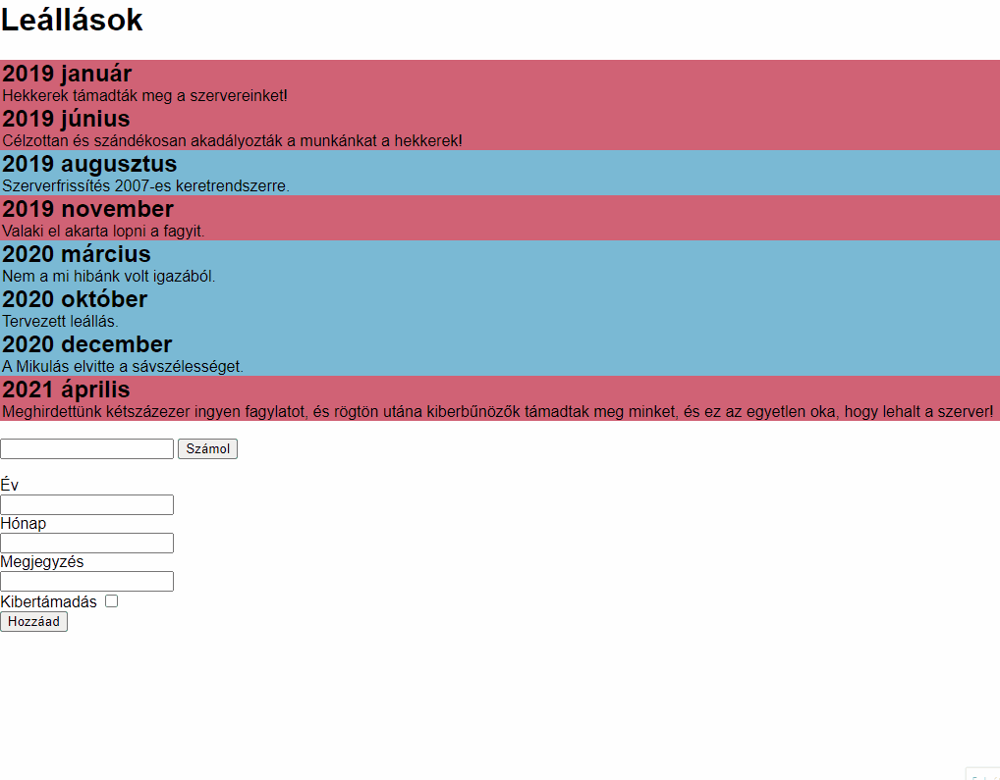

# CsoportZH

## Technikai infók
A feladat megoldására 45 perc áll rendelkezésre, plusz 5 perc kifejezetten a becsomagolásra és elküldésre.

Egy tömörített file-t küldjetek emailben a **mohmas@inf.elte.hu** címre, tárgy **[Web] CsoportZH - *Neptun-kódod*** (pl.: [Web] CsoportZH - MOHMAS). A szögletes zárójelek is legyenek a tárgyban, mert így biztosan a külön erre fenntartott mappába érkezik, nem pedig spambe, kukába stb (volt már rá példa sajnos).

A tömörített állományokban található php fileokat nem szokta megfogni a levelezőrendszer, de ha mégis visszadobná (erről küld e-mailt), akkor a php file kiterjesztését írjátok át, tehát index.php helyett legyen például index.php.txt vagy index.txt.

**TÖLTSD KI A NEPTUN.TXT FILET, ÉS NEVEZD ÁT A SAJÁT NEPTUNKÓDODNAK MEGFELELŐRE!**

## GYIK
- **Nem** lesz pótZH.
- A tört pont nem kerekül.
- Nem lehet JavaScripttel megoldani.
- Mindegy, hogy néz ki.
- Én javítom.
- Lehet az órai kódokat használni.
- Lehet a Googleben keresni, de az órai kódokban könnyebb.
- type="submit" value="Számol"
- Azért dobja a permission errort, mert nem adtál írási jogot a filera.

## Lore
Yavaszkripsztán legnagyobb állami fagylaltgyára, a Nemzeti Jéeskrém Manufaktúra hatalmas mennyiségű online rendelést vesz fel. A rendszerüket a yavaszkripsztáni felsőoktatás titánjára, a Saturn rendszerre építették, ami 2000 óta kiválóan működik, azonban néha leáll. Ezeket a leállásokat számon tartja a Manufaktúra, mivel nem mindig mezei hibáról vagy karbantartásról van szó - rendszeresen kibertámadás éri a rendszert.

Minden leállásról tudjuk az évet, a hónapot, a hozzá fűzött megjegyzést, és azt, hogy kibertámadás okozta, vagy sem.

## Induló kód
- Az induló kódban megtalálod az adatokat JSON fileban és PHP objektumok tömbjeként is, használd belátásod szerint bármelyiket.
- Az induló HTML filet érdemes átalakítani PHP-vé, és azzal dolgozni, de nem követelmény.
- Az induló HTML fileban adott stílusokhoz nem feltétlen kell hozzányúlni, megoldható a feladat csak azok használatával, de nem kötelező használni/meghagyni őket.
- Az induló HTML fileban lévő listában található adatok csak mintaként szolgálnak, azokat ne hagyd benne a feladat megoldásakor!

**Szánj időt az induló adatok értelmezésére!**

## Feladatok

### 1. Feladat (2 pont)
- a) Kilistázod címekbe és bekezdésekbe a leállások évét, hónapját és a hozzájuk tartozó megjegyzést. (1 pont)
    - *Az index.html induló fileban látod ehhez a mintát.*
- b) A listázott elemek színe piros, ha a leállást kibertámadás okozta, kék, ha nem. (1 pont)
    - *Érdemes használni a `nem-tamadas` és `kibertamadas` stílusosztályokat, de nem kötelező.*

### 2. Feladat (3+1 pont)
- a) A lista alatti mező elküldi valahova az évet valamilyen kérésparaméterként. (0.5 pont)
- b) A lista oldala megkapja valahonnan az évet valamilyen kérésparamétereként. (0.5 pont)
- c) Kiírod a paraméterként kapott évet a lista alá. (0.5 pont)
- d) Kiírod, hogy az adott évben több kibertámadás történt-e, mint 2. (1.5 pont)
- **Plusz pont:** Ha nem érkezik paraméter, nem írod ki a körítő szöveget se. (1 pont)
    - *Ha eleve nem írsz ki semmit, ez a plusz pont természetesen nem jár.*

### 3. Feladat (5+2 pont)
- a) A lista alatti mező elküldi valahova az évet, a hónapot, a megjegyzést és a kibertámadás-jelleget. (0.5 pont)
- b) Az a) részfeladatból kapott adatokra ellenőrzöd a következőket:
    - Megérkezett az év, hónap és megjegyzés paraméter, azok nem üresek. (0.5 pont)
    - Az év paraméter egy szám. (0.5 pont)
    - Az év paraméter egész. (0.5 pont)
    - Az év paraméter értéke legalább 2000. (0.5 pont)
- c) Az alábbiak közül csak az egyikre jár pont, egymást kizárják:
    - A fogadó oldalon az adatokat egy objektumba teszed, és azt az objektumot kidumpolod az oldalra. (0.5 pont)
    - A fogadó oldalról az adatokat strukturálatlanul beleírod egy fileba, akár felülírva annak tartalmát. (1 pont)
    - A fogadó oldalról az adatokat hozzáfűzöd egy JSON fileban tárolt tömbhöz, és visszamented a fileba. (1.5 pont)
- d) A c) feladatrészben a kiírás/mentés csak akkor történik meg, ha nem volt hiba az adatokban (0.5 pont)
    - *Ha az ellenőrző feladatrészt nem sikerült megcsinálni, akkor a feltétel lehet konstans igaz, de kommentben jelezd, mit kéne ellenőrizni!*
- e) Az adatok elküldése után visszajutunk a főoldalra. (0.5 pont)
- **Plusz pont:** Az c) feladatrészben keletkezett hibákat kiírod a felhasználónak. (2 pont)

## Megoldás

