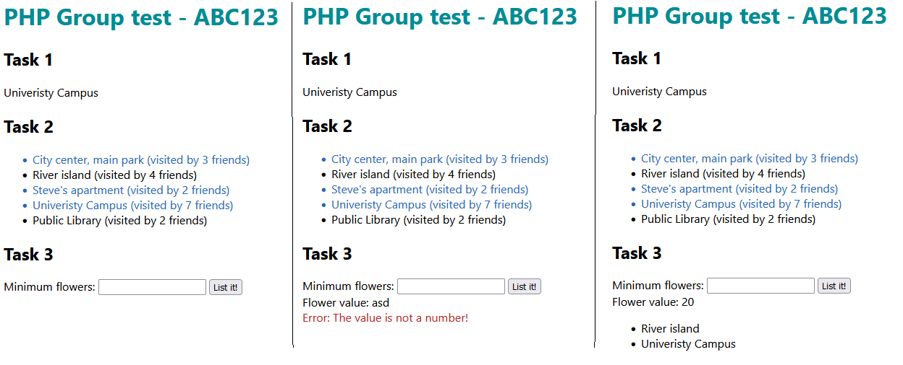

# PHP Group Test - Example
## Lore
A friend group collected the places they usually go to smell pretty flowers. Because the beauty of the flowers makes them dizzy, they tend to forget where they've been before, so they want to create a simple administration program to make their life easier.

## Starting code
```PHP
[
    (object)[
        'place' => 'City center, main park',
        'flowersSmelled' => 12,
        'visitedBy' => ['Steve', 'David', 'Christopher']
    ],
    (object)[
        'place' => 'River island',
        'flowersSmelled' => 27,
        'visitedBy' => ['Laure', 'Christopher', 'Patrick', 'Orsy']
    ],
    (object)[
        'place' => 'Steve\'s apartment',
        'flowersSmelled' => 4,
        'visitedBy' => ['Steve', 'Victor']
    ],
    (object)[
        'place' => 'Univeristy Campus',
        'flowersSmelled' => 43,
        'visitedBy' => ['Steve', 'David', 'Christopher', 'Laure', 'Orsy', 'Patrick', 'Victor']
    ],
    (object)[
        'place' => 'Public Library',
        'flowersSmelled' => 2,
        'visitedBy' => ['Laure', 'Orsy']
    ]
]
```

## Important note
You can not use JavaScript to solve any part of the tasks, you have to use PHP!

## How it will look
Three different states of the same page.


## 1. Task - 1 point
Which place was visited by the most friends?  
Write the solution onto the page!

## 2. Task - 2+1 points
Write all place names into an unordered list onto the page, followed by the amount of friends who were there! (2)  
If a place was visited by Steve, make it blue! (1)  

## 3. Task - 2+2 points
Have a form on the page that reads a number. If we send the form, write the flower value under the form! (1)  
List the places where at least as many flowers were smelled as the given value! (1)  
If the user enters something that is not a number, show an error! Solve this via PHP, not a built in HTML feature! (1)  
Don't have any warnings or error messages caused by an empty query parameter when first loading the page! (1)  

## 4. Task - 2 points
Instead of having the data in the code, read it from a JSON file!


```JS
[
    {
        "place": "City center, main park",
        "flowersSmelled": 12,
        "visitedBy": ["Steve", "David", "Christopher"]
    },
    {
        "place": "River island",
        "flowersSmelled": 27,
        "visitedBy": ["Laure", "Christopher", "Patrick", "Orsy"]
    },
    {
        "place": "Steve's apartment",
        "flowersSmelled": 4,
        "visitedBy": ["Steve", "Victor"]
    },
    {
        "place": "Univeristy Campus",
        "flowersSmelled": 43,
        "visitedBy": ["Steve", "David", "Christopher", "Laure", "Orsy", "Patrick", "Victor"]
    },
    {
        "place": "Public Library",
        "flowersSmelled": 2,
        "visitedBy": ["Laure", "Orsy"]
    }
]
```