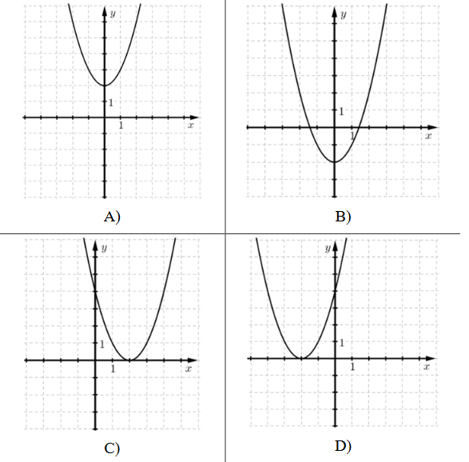

# PHP - CsoportZH

## Információk
- A feladatmegoldására 45 perc van, a Canvas feltöltésre további 5.
- Adott egy induló csomag zip-ként.
    - Induló PHP, de nem kötelező azt használni (`index.php`, `points.php`).
    - Induló adathalmaz (`data.php`). Az `$o_data`és az `$a_data` változók megegyeznek, csak az egyikben objektumként, a másikban asszoziatív tömbként vannak tárolva az adatok. Használd azt, amelyiket jobban szereted.
    - Induló readme file (`readme.md`).
    - Egy kép az egyik feladathoz.
- Egyetlen zip filet tölts fel, melynek tartalma:
    - Egy (vagy több) PHP file.
    - Egy readme file.
    - Egy kép az egyik feladathoz.
- A webes számonkéréseknél README file-t használunk, hogy könnyebben követhessük, szerintetek mely részfeladatokra kéne pontot adnunk. Így, ha valami nem egyértelmű, hogy jelen van, tudjuk, hogy keresni kell. Írj `x` ikszet a zárójelek közé, ha a feladat kész; `.` pontot, ha elkezdted, de nincs kész; hagyd üresen szóközzel, ha nem kezdtél bele.
- Ezen felül ebben a fileban van egy bekezdés, amit bele kell tennem. Ez a HKR szabályozásainak tudomásul vételéről szól.
    - ELTE HKR, IK kari különös rész 377/A. § : Az a hallgató, aki olyan tanulmányi teljesítménymérés (vizsga, zárthelyi, beadandó feladat) során, amelynek keretében számítógépes program vagy programmodul elkészítése a feladat, az oktató által meghatározottakon kívül más segédeszközt vesz igénybe, illetve más hallgatónak meg nem engedett segítséget nyújt, tanulmányi szabálytalanságot követ el, ezért az adott félévben a tantárgyat nem teljesítheti és a tantárgy kreditjét nem szerezheti meg.
```
Kovácz Gergely Áron
C2R1Y3
Web-fejlesztés 2. - számonkérés

Ezt a megoldást a fent írt hallgató küldte be és készítette a Web-fejlesztés 2. kurzus számonkéréséhez.
Kijelentem, hogy ez a megoldás a saját munkám. Nem másoltam vagy használtam harmadik féltől 
származó megoldásokat. Nem továbbítottam megoldást hallgatótársaimnak, és nem is tettem közzé. 
Nem használtam mesterséges intelligencia által generált kódot, kódrészletet.
Az ELTE HKR 377/A. § értelmében, ha nem megengedett segédeszközt veszek igénybe,
vagy más hallgatónak nem megengedett segítséget nyújtok, a tantárgyat nem teljesíthetem.

[x] 1. Ez egy példa feladat, ami hibátlanul készen van.
[ ] 2. Ez egy példa feladat, amibe Gergő nem kezdett bele.
[.] 3. Ez egy példa feladat, amibe Gergő belekezdett, de nem fejezte be, vagy nem működik teljesen.
```

## Lore
Üdvözlet a 2075-ös Matematika Érettségin! Idén először az érettségi teljesen online formában zajlik, és nincs szükség rá, hogy kinyomtassunk 120ezer harminc oldalas feladatgyűjteményt a hét minden napjára. Természetesen az érettségiztető szoftvert Te fogod elkészíteni!

## 1. Feladat - 1 pont
Generálj minden feladathoz egy `task` stílusosztályú div-et!
```HTML
<div class="task"></div>
```
- *Ha nem tudsz minden feladathoz divet generálni: Innentől minden feladatot úgy értelmezz, hogy elég az adatokból az első `task` objektummal dolgoznod. Nyilvánvalóan ez nem azt jelenti, hogy egyből HTML-be beégeted például a `task` `description`-jét, hanem hogy a tömbből csak az első elemet használod, és nincs körülötte ciklus.*

## 2. Feladat - 1 pont
Minden `task` divben legyen egy `h2` címsor, amiben a feladat sorszáma és a leírása szerepel egy-egy megfelelő `task-num` és `task-desc` stílusosztályú span elemben.
```HTML
<h2>
    <span class="task-num">1.</span>
    <span class="task-desc">Az A és B halmazokról tudjuk, hogy A = {2; 3; 5}, A ∩ B = {2; 3}, A ∪ B = {1; 2; 3; 4; 5}. Elemei felsorolásával adja meg a B halmazt!</span>
</h2>
```

## 3. Feladat - 2 pont
Minden `task` divben legyen egy `div` elem, `task-img` stylusosztályal. Ha nem üres az adott feladat `image` attribútuma, a divben legyen egy `img` elem, aminek a `src` attribútuma a feladat képének a neve.
```HTML
<div class="task-img">
</div>

VAGY

<div class="task-img">
    
</div>
```

## 4. Feladat - 2+1 pont
Minden `task` divben legyen egy táblázat egy sorral és három cellával: válasz mező (`task-answer`), max pontok (`max-pts`), kapott pontok (`got-pts`). A max pontok mezőbe kerüljön be a feladat pontértéke.
```HTML
<table>
    <tr>
        <td class="task-answer"></td>
        <td class="max-pts">2 pont</td>
        <td class="got-pts"></td>
    </tr>
</table>
```
A válasz mezőbe kerüljön egy `input` mező valamilyen `name` attribútummal.
- Javaslom, hogy a `name` értéke a feladat `id`-ja legyen, de ez rajtad múlik, hogy szeretnéd majd használni.

```HTML
<td class="task-answer">
    <input name="1">
</td>
```

## 5. feladat - 1 pont
Minden, amit generáltál, legyen egy `form` elemben, ami a `points.php` file-ra irányít.
```HTML
<form >  <!--nyilván ide a form után írnod kell valami-->
    <div class="task">...</div>
    <div class="task">...</div>
    <div class="task">...</div>
    <div class="task">...</div>
    <input type="submit">
</form>
```
- *Nem kötelező a points.php filera irányítani, megoldható a feladat helyben - de ez esetben csak akkor jár a pont az 5. feladatra, ha a 6. feladat helyesen van megoldva az index.php-ban.*

## 6. Feladat - 2 pont
A `points.php` ellenőrizze, hogy a megadott válaszok egyeznek-e a feladatok `answer` attribútumával. Összesítsd a pontokat, és írd ki, hány pontot ért el a diák a maximumból.
```HTML
<h1>6 / 8 pont</h1>
```

## +1. Feladat - +2 pont
A következőket tedd meg a `points.php`-ben:
- Minden válasz körül vágjuk le a feleslegek szóközöket.
- Minden válasz kisbetűs legyen.

Ez után pedig ellenőrizd, hogy:
- Az első feladatra vesszőkkel elválasztott számokat adott meg a diák.
- A második és harmadik feladatra egy számot adott meg a diák.
Ha nem, akkor a feladat pontjait nullázd le.