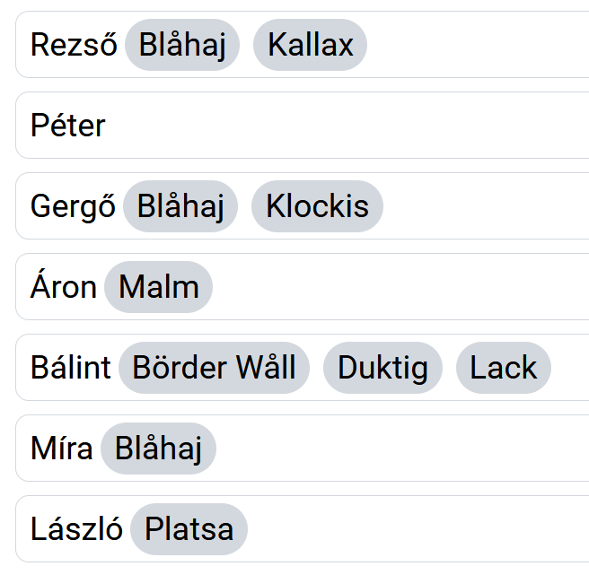

# JavaScript - CsoportZH

## Információk
- A feladatmegoldására 45 perc van, a Canvas feltöltésre további 5.
- Adott egy induló csomag zip-ként.
    - Induló HTML, de nem kötelező azt használni (`index.html`).
    - Induló adathalmaz (`script.js`).
    - Induló readme file (`readme.md`).
- Egyetlen zip filet tölts fel, melynek tartalma:
    - Egy HTML file.
    - Egy (vagy több) JS file.
    - Egy readme file.
- A webes számonkéréseknél README file-t használunk, hogy könnyebben követhessük, szerintetek mely részfeladatokra kéne pontot adnunk. Így, ha valami nem egyértelmű, hogy jelen van, tudjuk, hogy keresni kell. Írj `x` ikszet a zárójelek közé, ha a feladat kész; `.` pontot, ha elkezdted, de nincs kész; hagyd üresen szóközzel, ha nem kezdtél bele.
- Ezen felül ebben a fileban van egy bekezdés, amit bele kell tennem. Ez a HKR szabályozásainak tudomásul vételéről szól.
    - ELTE HKR, IK kari különös rész 377/A. § : Az a hallgató, aki olyan tanulmányi teljesítménymérés (vizsga, zárthelyi, beadandó feladat) során, amelynek keretében számítógépes program vagy programmodul elkészítése a feladat, az oktató által meghatározottakon kívül más segédeszközt vesz igénybe, illetve más hallgatónak meg nem engedett segítséget nyújt, tanulmányi szabálytalanságot követ el, ezért az adott félévben a tantárgyat nem teljesítheti és a tantárgy kreditjét nem szerezheti meg.
```
Ráczkevey Péter
R216KT
Webprogramozás - számonkérés

Ezt a megoldást a fent írt hallgató küldte be és készítette a Webprogramozás kurzus számonkéréséhez.
Kijelentem, hogy ez a megoldás a saját munkám. Nem másoltam vagy használtam harmadik féltől 
származó megoldásokat. Nem továbbítottam megoldást hallgatótársaimnak, és nem is tettem közzé. 
Nem használtam mesterséges intelligencia által generált kódot, kódrészletet.
Az ELTE HKR 377/A. § értelmében, ha nem megengedett segédeszközt veszek igénybe,
vagy más hallgatónak nem megengedett segítséget nyújtok, a tantárgyat nem teljesíthetem.

[x] 1. Ez egy példa feladat, ami hibátlanul készen van.
[ ] 2. Ez egy példa feladat, amibe Péter nem kezdett bele.
[.] 3. Ez egy példa feladat, amibe Péter belekezdett, de nem fejezte be, vagy nem működik teljesen.
```

## Lore
Egy baráti társaság IKEA vásárló körutat tervez. Segíts nekik, hogy semmit ne felejtsenek el megvenni!

## 1. Feladat - 2 pont
Van olyan ember, aki több temréket is venni szeretne? A választ a konzolra írd ki!

*Helyes megoldás:*
```js
true
```

## 2. Feladat - 2 pont
Listázd ki a konzolra azokat az embereket, akik vettek `Blåhaj` nevű terméket!

*Helyes megoldás (formátum lehet más): *
```js
0: Object { name: "Rezső", items: (2) […] }
1: Object { name: "Gergő", items: (2) […] }
2: Object { name: "Míra", items: (1) […] }
```

## 3. Feladat - 2 pont
Írd ki dinamikusan (javascripttel) az összes ember nevét egy-egy `person` stílusosztályú divbe!

*Helyes megoldás:*
```html
<div id="people">
    <div class="person">Rezső</div>
    <div class="person">Péter</div>
    <div class="person">Gergő</div>
    <div class="person">Áron</div>
    <div class="person">Bálint</div>
    <div class="person">Míra</div>
    <div class="person">László</div>
</div>
```

## 4. Feladat - 2 pont
Minden név mellé, a `div` tagen belülre helyezd el az adott emberhez tartozó termékeket külön-külön `span` elemekbe.

*Helyes megoldás:*
```html
<ul id="people">
    <div class="person">Rezső <span>tűzgyújtó folyadék</span><span>öngyújtó</span><span>szalonna</span><span>kenyér</span></div>
    <div class="person">Péter <span>tűzifa</span></div>
    <div class="person">Gergő <span>virsli</span><span>hagyma</span><span>mustár</span><span>ketchup</span><span>kifli</span></div>
    <div class="person">Áron</div>
    <div class="person">Bálint <span>kézi fűrész</span><span>sör</span><span>papírpohár</span><span>papírtányér</span><span>evőeszköz</span></div>
    <div class="person">Míra <span>sió vitatrigris</span><span>papírtörlő</span></div>
    <div class="person">László</div>
</ul>
```
*Ha az előre megadott HTML-be dolgozol, így fog kinézni:*  


## 5. Feladat - 2 pont
Ha rákattintunk egy `span` elemre, jelöld meg késznek (alkalmazd rá a `done` stílusosztályt)!

## +1. Feladat - +1 pont
Az 5. Feladatot delegálással oldd meg, több eseménykezelő és ciklus nélkül.
```JS
function delegate(parent, child, when, what){
    function eventHandlerFunction(event){
        let eventTarget  = event.target
        let eventHandler = this
        let closestChild = eventTarget.closest(child)

        if(eventHandler.contains(closestChild)){
            what(event, closestChild)
        }
    }

    parent.addEventListener(when, eventHandlerFunction)
}
```

## +2. Feladat - +1 pont
Ha rákattintunk egy kész elemre, legyen újra nem kész (vedd le a `done` stílusosztályt).