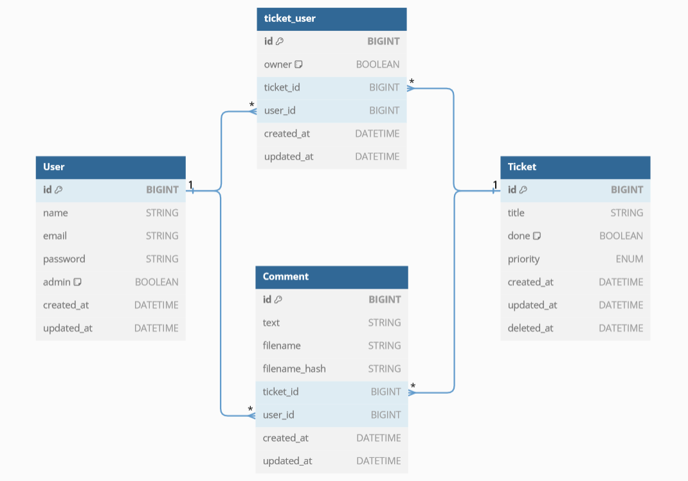

# Szerveroldali 7. gyak
*Disclaimer: a gyakorlaton haladva eltérünk attól, amit előre terveztem, így kisebb nagyobb különbségek vannak a kódban.*  
- ⌨️ : Githubon a sources mappában megtalálod az ide tartozó kódrészletet.
- ⚠️ : Ez egy feladat, amit neked kell megcsinálnod.

KisZH: 🌈 Nincs, mert új témát kezdünk.

*A kiinduló kódokért és rengeteg segítségért hatalmas köszönet Németh Tamás (Bajusz)nak!*

*Eléggé imprós lesz a kövi pár gyakorlat, szóval érdemesebb a felvétel alapján haladni, a jegyzet inkább a jövő évieknek lesz hasznos, mert akkor az idei év alapján már meg tudom csinálni előre. Also, itt elég sok lesz az elmélet, amit szóban fogok magyarázni.*

## Elindulás
Töltsd le a `Start.zip` filet a kezdéshez, és csomagold ki egy tetszőleges mappába, majd lépj bele command prompttal/powershellel/felőlem bármivel.
- `composer install` : Telepíti a composer (PHP) függőségeket
- `npm install` : Telepíti a node (JavaScript) függőségeket.
- `npm run build` : Összecompileolja a frontend csomagokat. (Amúgy nem nagyon fogjuk használni a frontendet tbh)
- `cp .env.example .env` : Lemásolja a példa env filet és elnevezi a tényleges env filenak. Ezt kézzel is meg tudod csinálni.
- `touch database/database.sqlite` : Csinál egy üres database.sqlite filet a helyére. Ez windowson nem fog menni, csinálhatod kézzel.
- `php artisan storage:link` : Setupolja nekünk a storage mappa kapcsolatot, hogy a storage/app/public mappa elérhető legyen kívülről.
- `php artisan key:generate` : Generál egy kulcsot a .env fileba.
- `php artisan migrate:fresh --seed` : Setupolja az adatbázist.
- `php artisan serve` : Elindítja a progrmot.

## Adatbázis
### User (users)

Az alkalmazás felhasználóit tartalmazó tábla.

  - id: `BIGINT` (PK)
  - name: `STRING`
  - email: `STRING` (UNIQUE)
  - password: `STRING`
  - admin: `BOOLEAN` (DEFAULT: false)
  - created_at: `DATETIME`
  - updated_at: `DATETIME`

### Ticket (tickets)

A beküldött hibajegyek adatait tároló tábla.

A `priority` mező enumerátor, ahol a `0` a legalacsonyabb, `3` a legmagasabb prioritást jelenti.

A modell _soft delete_ mechanizmust használ.

  - id: `BIGINT` (PK)
  - title: `STRING`
  - done: `BOOLEAN` (default: `false`)
  - priority: `ENUM` (`[0,1,2,3]`)
  - created_at: `DATETIME`
  - updated_at: `DATETIME`
  - deleted_at: `DATETIME`

### ticket_user (pivot)

Kapcsolótábla a **users** és a **tickets** táblák között. Ha az owner értéke igaz, akkor az a felhasználó volt a ticket eredeti beküldője, mindenki más csak extrába még hozzá van rendelve.

  - id: `BIGINT` (PK)
  - owner: `BOOLEAN` (default: `false`)
  - ticket_id: `BIGINT` (FK: tickets)
  - user_id: `BIGINT` (FK: users)
  - created_at: `DATETIME`
  - updated_at: `DATETIME`

### Comment (comments)

A hibajegyekhez tartozó hozzászólásokat tartalmazó tábla.

  - id: `BIGINT` (PK)
  - text: `STRING`
  - filename: `STRING` (NULLABLE)
  - filename_hash: `STRING` (NULLABLE)
  - ticket_id: `BIGINT` (FK: tickets)
  - user_id: `BIGINT` (FK: users)
  - created_at: `DATETIME`
  - updated_at: `DATETIME`

### Adatbázis kapcsolatok:




## Autentikáció
Az autentikációhoz [Laravel Sanctum](https://laravel.com/docs/11.x/sanctum)ot fogunk használni. Ennek a lényege, hogy egy tokent tárol, amivel beazonosítható a felhasználó, és ezt a tokent kijelentkezéskor revoke-olja (illetve lejárat és purge is beállítható configoláskor; de az API tokenek tipikusan hosszú ideig érvényesek). Ha esetleg korábban már használtál JWT autentikációt, ez nagyon más, hiszen a JWT nem tárolja a tokent, hanem a tokent decryptelve kap meg minden infót stateless módon. Megjegyzés, lehet ilyen cookie based session authenticationt csinálni itt is, ezt SPA-nak hívják.

Itt sok minden mesélős dolog van, nem írom le külön, elmondom gyakon.

### Setup
- `php artisan install:api` : Telepíti a laravel Sanctumot
    - A végén lehet, hogy ad egy promptot, hogy yes/no, hogy futtassa az új migrációt.
    - `php artisan migrate` : Ez csak akkor kell, ha a telepítés végén nem dobta fel a yes/no ablakot, vagy nem futtattad.
- A `User` modellhez hozzá kell adni a `Laravel\Sanctum\HasApiTokens` traitet.
- `php artisan make:controller ApiController` : Ha szeretnéd elkülöníteni a routert a kontrollertől (app/http/controllers/ApiController.php)
- A `bootstrap/app.php` fájlt ki kell egészíteni az **apiPrefix**-el (ha belenézel a fileba, érthető lesz, hova kell ezt rakni)
    ```php
    ...
    ->withRouting(
    ...
    api: __DIR__.'/../routes/api.php',
    apiPrefix: 'api', // <<-- ezt a sort akarod beszúrni
    ...
    )
    ```
- Opcionálisan érdemes készíteni egy middleware-t, mert a hibaüzenetek nem JSON-ként vannak visszaadva alapértelmezetten. 
    - `php artisan make:middleware ForceJSONResponseAPI` : Ez elkészíti a middleware-t (app/http/middleware/ForceJSONResponseAPI.php)
    - Fel kell tölteni a logikával
        ```PHP
        public function handle(Request $request, Closure $next): Response
        {
            // Ellenőrizzük, hogy a meghívott végpont api végpont-e, és az Accept mező beállításra került-e.
            if ($request->is('api/*') && !$request->headers->contains('Accept', 'application/json')) {
                $request->headers->set('Accept', 'application/json');
            }
            return $next($request);
        }
        ```