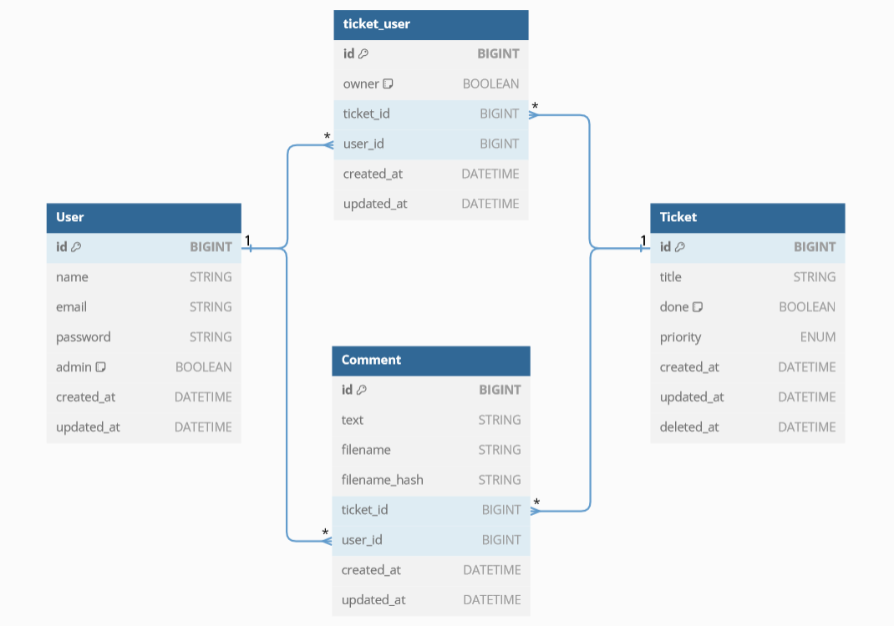

# Ticket (REST API)

A demonstrációs alkalmazás egy egyszerű ticket (hibajegy) kezelő rendszer. Az alkalmazás végtelenül egyszerű, de minden fontos témakört érint.

Az átláthatóság kedvéért mindegyik commit egy-egy témakör. A commit message-eket pedig igyekszem sablonizálni pl.: "REST API | 1.2. Alapvető végpontok és URI paraméterek".

Fontos, hogy a commit-ok csupán az egyes témakörök jobb átláthatóságáért kerültek ilyen módon felbontásra. Az anyag átadásakor ezeket érdemes együttesen leadni.

## Install

  - `composer install`
  - `npm install` (optional)
  - `npm run build` (optional)
  - `cp .env.example .env`
  - `touch database/database.sqlite`
  - `php storage:link` (+ szükség esetén a storage link törlése a public könyvtárból)
  - `php artisan key:generate`
  - `php artisan migrate:fresh --seed`
  - `php artisan serve`

## Adatbázis / Modellek

### User (users)

Az alkalmazás felhasználóit tartalmazó tábla.

  - id: `BIGINT` (PK)
  - name: `STRING`
  - email: `STRING` (UNIQUE)
  - password: `STRING`
  - admin: `BOOLEAN` (DEFAULT: false)
  - created_at: `DATETIME`
  - updated_at: `DATETIME`

### Ticket (tickets)

A beküldött hibajegyek adatait tároló tábla.

A `priority` mező enumerátor, ahol a `0` a legalacsonyabb, `3` a legmagasabb prioritást jelenti.

A modell _soft delete_ mechanizmust használ.

  - id: `BIGINT` (PK)
  - title: `STRING`
  - done: `BOOLEAN` (default: `false`)
  - priority: `ENUM` (`[0,1,2,3]`)
  - created_at: `DATETIME`
  - updated_at: `DATETIME`
  - deleted_at: `DATETIME`

### ticket_user (pivot)

Pivot tábla a **users** és a **tickets** táblák között. Az owner határozza meg a ticket-et beküldő felhasználót.

  - id: `BIGINT` (PK)
  - owner: `BOOLEAN` (default: `false`)
  - ticket_id: `BIGINT` (FK: tickets)
  - user_id: `BIGINT` (FK: users)
  - created_at: `DATETIME`
  - updated_at: `DATETIME`

### Comment (comments)

A hibajegyekhez tartozó hozzászólásokat tartalmazó tábla.

  - id: `BIGINT` (PK)
  - text: `STRING`
  - filename: `STRING` (NULLABLE)
  - filename_hash: `STRING` (NULLABLE)
  - ticket_id: `BIGINT` (FK: tickets)
  - user_id: `BIGINT` (FK: users)
  - created_at: `DATETIME`
  - updated_at: `DATETIME`

### Adatbázis kapcsolatok:

## Témakörök

A REST API témakör Laravel-be való áttérésével nem kell áttérni NodeJS-re és nem kell megtanulni új keretrendszereket.

Ezáltal a következő témakörök kerülnek ki a tananyagból:
  - NodeJS alapok
  - JS async
  - Fastify alapok
  - Eloquent ORM

Mivel a CRUD jól működik együtt a REST-tel, nem ismételjük magunkat, ezért az én tempómmal számolva akár 3 gyakorlatot is meg tudunk spórolni. Emiatt más fontos és érdekes témaköröket is tudunk érinteni, amik eddig nem fordultak elő (autentikáció-abilities, middleware és provider készítés, tesztelés, deployment, events stb.)

### 0. Init

A `REST-API | 0. Init` commit tartalmazza az előkészített Ticket feladatot. Ebben a legtöbb dolog (pl.: webes nézetek, CRUD stb.) már benne van, innen fogom kezdeni a REST-es részt.

### 1. Authentikáció

  - **[Laravel Sanctum](https://laravel.com/docs/11.x/sanctum)**
    - 2 féle authentikáció: stateful és stateless
      - [_SPA Authentication (Stateful)_](https://laravel.com/docs/11.x/sanctum#spa-authentication)
        - Session cookie alapján authentikálja a felhasználót
        - SPA esetén hasznos, egyszerű
      - [_API Token Authentication (Stateless)_](https://laravel.com/docs/11.x/sanctum#api-token-authentication)
        - Bearer token használata
        - **Az egyszerűség kedvéért (ne kelljen session cookie-kkal vacakolni), ezt adom le.**
  - **JWT**: A Sanctum-mal lehet token authentikációt végezni, azonban az eltárolásra kerül az adatbázisban. A `tymon/jwt-auth` package segítségével lehet implementálni a JWT-t, vagy van több PHP-s JWT implementáció is, melyekre lehet készíteni provider-t. Azonban a JWT-t ezen a ponton feleslegesnek tartom. Természetesen előadáson essen róla szó. Ráadásul a Sanctum megoldja a JWT token revoke problémáját...
  - **Passport**: OAuth2, csak említés szintjén ajánlom, esetleg EA?
  - **Laravel Socialite**: 3th party authentikáció (pl.: GitHub) csak említés szintjén. A megvalósítás hasznos lehet EA-on.

### 2. Routing

Laravel 11-ben több struktúrális változás is történt, amelyek miatt kidobtak több middleware-t, provider-t és config fájlt. Ezek közül minket a `RouteServiceProvider` és a `routes/api.php` fájlok érintenek a leginkább.

#### 2.1. API végpontok előkészítése

  - Egyszerű megoldás prefix group-pal: `Route::prefix('api')->group(function () {...})`
  - RouteServiceProvider visszavezetése (provider készítése)

#### 2.2. URI paraméterek és azok validációja

  - Beépített megoldás használata (regex) ==> 404 error mindig (ez az esetek nagy részében helyes, hiszen URI paraméterben leginkább azonosítókat szoktunk amúgy is lekérdezni. Query stringek-et nem szoktunk írni...)
  - Custom middleware készítése (request obj-en keresztül elérhető minden)
  - Router-en átengedni és lekezelni a controllerben (abort(4XX) fv.)

### 3. REST végpontok készítése

#### 3.1. Alapvető REST végpontok

  - Alapvető végpontok készítése (a témakör nagy része már lement, a különbség, hogy most JSON a válasz és nem view)
  - `Hello there!` típusú egyszerű JSON végpontok
  - CRUD (ha valaki csak a [Resource Controller](https://laravel.com/docs/11.x/controllers#resource-controllers) témakört vette eddig át, itt lehet mutatni GET, POST, PUT/PATCH, DELETE végpontok manuális elkészítését is)

#### 3.2. Body validáció

  - Az eddig használt validátor használata
  - Validátor készítése manuálisan
  - FormRequest használata

#### 3.3. Összetettebb REST végpontok

  - A ZH-ban a nehezebb feladatokat lefedő statisztikai és "szinkronizáció"-szerű (pl.: felhasználók rendezése a hibajegyeken) feladatok elkészítése.

### 4. Response

#### 4.1 JSON Response (API Resource)

  - Egyszerű JSON válasz küldése: `return response()->json(['key' => 'value']);`
  - (API Resource)[]: Modellek küldése JSON formátumban egyszerűbb, átláthatóbb és újrahasznosíthatóbb formában.

#### 4.2. File download

  - Fájl letöltése: `return response()->download($pathToFile, $name, $headers);`
  - Fájl megnyitása a user böngészőjében: `return response()->file($pathToFile, $headers);`

### 5. Tesztelés

  - Automatikus Feature/Unit tesztek írása

### 6. Deployment (kiegészítő anyag)

  - Éles környezetbe való átültetés, teendők.
  - Shared deploy (pl.: AFS) okozta problémák kiküszöbölése

### 7. Events (kiegészítő anyag)

  - Eddig egyáltalán nem esett szó az event-ekről, ami szintén egy elég elterjedt témakör.
  - Subscribers (observers), generate custom events
  - Queue-ba is bele lehet menni idő függvényében természetesen, mert combos téma
    - Előny, hogy nem feltétlenül szükséges 3th party backend hozzá (pl.: Redis), mert elérhető a database driver (jobs tábla)

## Javasolt tanrend (0. verzió)

Ahogy haladok a különböző témakörökkel, frissítem aszerint, hogy mennyi idő volt implementálni.

**Ez inkább saját jegyzet, kalkuláció. Mindenképpen kezeljétek fenntartásokkal!**

**7\. gyakorlat**

  - Authentikáció
  - Routing
  - Alapvető REST végpontok

**8\. gyakorlat**

  - CRUD REST végpontok
  - Body validáció
  - API Resource
  - Összetettebb végpontok

**9\. gyakorlat**

  - Tesztelés
  - Kiegészítő anyagok

**10\. gyakorlat**

  - GraphQL vagy további REST-es óra (idő függvényében)

**11-12. gyakorlat**

  - GraphQL
  - Gyakorlás a ZH-ra
  - Websocket?
