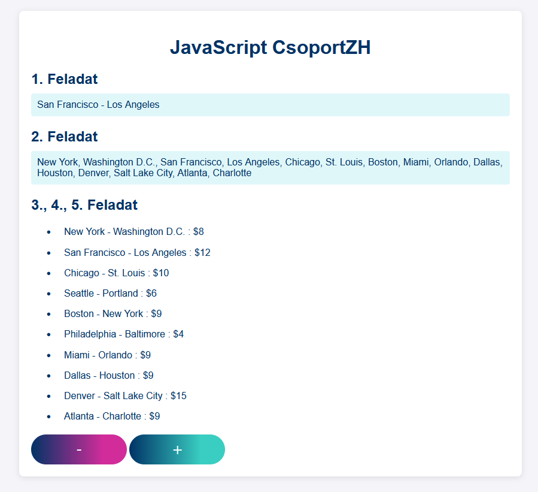

# JavaScript - CsoportZH

## Információk
- A feladatmegoldására 45 perc van, a Canvas feltöltésre további 10. A rendszer 17:00-kor lezár, nem lehet hosszabbítani.
- A feladatokat JavaScript nyelven kell megoldani, értelemszerűen nem kódba égetve, hanem programmal generálva (tehát a megoldás akkor is fusson, ha lecserélem a kiinduló adathalmazt).
- Adott egy induló csomag zip-ként, amit GitHubon és a Teams csoport file-jai közt is megtalálsz.
    - Induló HTML, de nem kötelező azt használni (`index.html`).
    - Induló CSS, de nem kötelező azt használni (`style.css`).
    - Induló adathalmaz (`script.js`).
    - Induló readme file (`Feladatok.md`).
- Egyetlen zip filet tölts fel **CANVASBE**, melynek tartalma:
    - Egy HTML file és a hozzá tartozó CSS (ha van).
    - Egy (vagy több) JS file.
    - Egy readme file.
- A webes számonkéréseknél README file-t használunk, hogy könnyebben követhessük, szerintetek mely részfeladatokra kéne pontot adnunk. Így, ha valami nem egyértelmű, hogy jelen van, tudjuk, hogy keresni kell. Írj `x` ikszet a zárójelek közé, ha a feladat kész; `.` pontot, ha elkezdted, de nincs kész; hagyd üresen szóközzel, ha nem kezdtél bele.
- Ezen felül ebben a fileban van egy bekezdés, amit kötelező bele tennem tennem, szóval itt van. Ez a HKR szabályozásainak tudomásul vételéről szól.
    - ELTE HKR, IK kari különös rész 377/A. § : Az a hallgató, aki olyan tanulmányi teljesítménymérés (vizsga, zárthelyi, beadandó feladat) során, amelynek keretében számítógépes program vagy programmodul elkészítése a feladat, az oktató által meghatározottakon kívül más segédeszközt vesz igénybe, illetve más hallgatónak meg nem engedett segítséget nyújt, tanulmányi szabálytalanságot követ el, ezért az adott félévben a tantárgyat nem teljesítheti és a tantárgy kreditjét nem szerezheti meg.

```
Ráczkevey Péter
R216KT
Webprogramozás - számonkérés

Ezt a megoldást a fent írt hallgató küldte be és készítette a Webprogramozás kurzus számonkéréséhez.
Kijelentem, hogy ez a megoldás a saját munkám. Nem másoltam vagy használtam harmadik féltől 
származó megoldásokat. Nem továbbítottam megoldást hallgatótársaimnak, és nem is tettem közzé. 
Nem használtam mesterséges intelligencia által generált kódot, kódrészletet.
Az ELTE HKR 377/A. § értelmében, ha nem megengedett segédeszközt veszek igénybe,
vagy más hallgatónak nem megengedett segítséget nyújtok, a tantárgyat nem teljesíthetem.

[x] 1. Ez egy példa feladat, ami hibátlanul készen van.
[ ] 2. Ez egy példa feladat, amibe Péter nem kezdett bele.
[.] 3. Ez egy példa feladat, amibe Péter belekezdett, de nem fejezte be, vagy nem működik teljesen.
```

## Lore
Az 1800-as évek végére az Egyesült Államok megmutatta, miért a vasút a közlekedés koronázatlan királya. Mutassuk ezt be a modern web koronázatlan királyának segítségével, a JavaScripttel.

## 1. Feladat - 2 pont
Írd ki egy 300 mérföldnél hosszabb vonal kiinduló és érkező állomását! (Feltételezheted, hogy létezik)
- Konzolra írva 1 pont
- A megfelelő HTML elembe írva 2 pont.

## 2. Feladat - 2 pont
*Ehhez a feladathoz tartozik pluszpontos feladat.*  
Írd ki az 5 óránál **hosszabb** vonalak által érintett városokat (kiinduló és érkező állomás; pont 5 óra még nem számít)!  

## 3. Feladat - 2 pont
Sorold fel a vonalakat az előre megadott listába a következő formátumban: `Kiinduló állomás - Érkező állomás : $x`

Például:
`<li>New York - Washington D.C. : $8</li>`

## 4. Feladat - 2 pont
*Ehhez a feladathoz tartozik pluszpontos feladat.*  
Ha rákattintunk egy listaelemre, jelöld ki (alkalmazd rá a `kivalasztva` stílusosztályt), ha egy kijelöltre kattintunk, szedd le a kijelölést!
- Kijelölés 1 pont
- Kijelölés és annak megszüntetése 2 pont

## 5. Feladat - 2 pont
Ha rákattintunk a `+` gombra, növeld a kijelölt vonalak árát 1 dollárral. Ha a - gombra, csökkentsd. Ha nem tudtad megoldani a 4. feladatot, tedd rá a `kivalasztva` stílusosztályt pár tetszőleges elemre beégetve, és azzal dolgozz.

## +1. Feladat - +1 pont
A 2. feladatban egy város csak egyszer legyen a listában (New York szerepel induló városként a 0. vonalon és érkező városként a 4. vonalon, és mindkettő 5 óránál hosszabb)

## +2. Feladat - +2 pont
A 4. Feladatot delegálással oldd meg, több eseménykezelő és ciklus nélkül.
```JS
function delegate(parent, child, when, what){
    function eventHandlerFunction(event){
        let eventTarget  = event.target
        let eventHandler = this
        let closestChild = eventTarget.closest(child)

        if(eventHandler.contains(closestChild)){
            what(event, closestChild)
        }
    }

    parent.addEventListener(when, eventHandlerFunction)
}
```

## Példa
A megoldás például így is kinézhet.

