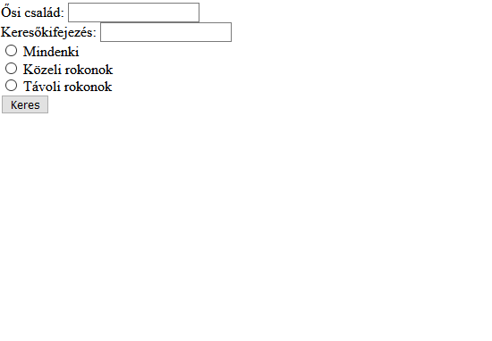

# PHP CsoportZH - Déli csoport

## Fontos
Ha a webprogramozás szerveren teszteled a kódot, akkor a mappaszerkezeted így nézzen ki, ha eléred (pl. WinSCP-vel):  
`hallgatok\neptunkod\www\mappanev\almappanev`  
Tehát kerüljön bele minden egy *www* nevű mappába, amit böngészőből látni szeretnél!  
Viszont amikor ezt már ténylegesen böngészőből próbálod elérni, akkor a *www* mappanév kimarad, tehát a webcím így nézzen ki:  
`webprogramozas.inf.elte.hu/hallgatok/neptunkod/mappanev/almappanev`

**Jelezd Teams-en a chatbe, ha ezt a ZH-t írod, mert Canvasben be kell állítanom a láthatóságot!**

## Lore
Egy baráti társaság szeretné visszakeresni, hogy milyen ősi családoktól származnak, és ehhez egy adminisztrációs programot szeretnének készíteni. Sajnos egyikük se ért az informatikához, de Te a segítségükre sietsz, hogy megoldd ezt a problémát! A cél az, hogy a baráti társaság egy-egy tagja rákereshessen Európa nagy családjaira, és a program kilistázza a leszármazottakat, illetve szűrhessen név szerint, vagy aszerint, hogy egy adott ember közeli vagy távoli leszármazottja a családnak.

## Feladat
Készíts PHP oldalt, melyen a következők találhatók:
- Legyen egy beviteli mező, amibe egy ősi családnevet kell beírnunk
- Legyen egy beviteli mező, amibe keresőkifejezést lehet írni, mely alapján majd a rokonokat szűrhetjük
- Legyenek választógombok, amik segítségével eldönthető, hogy milyen rokonokat keresünk:
    - Mindenkit
    - Közeli rokonokat
    - Távoli rokonokat
- Legyen egy gomb, mely kattintásra egy listába kiírja az oldalra a rokonokat keresési paraméterek szerint:
    - Ősi családnév
        - Ha a név nincs megadva, akkor írjunk ki hibaüzenetet, és ne listázzuk az ügyfeleket
        - Ha a név nem szerepel az ősi családnevek közt (`Habsburg`, `Romanoff`, `Bourbon`), akkor írjunk ki hibaüzenetet
        - Ha a név szerepel az ősi családnevek közt, akkor listázzuk ki ezen család leszármazottait
    - Keresőmező
        - Ha a beviteli mező üres, akkor ne szűrjön névre, hanem mindenkit listázzon ki
        - Ha van beleírva valami, akkor csak azok a rokonok listázódjanak ki, akiknek a nevében benne van a keresőkifejezés
    - Választógombok
        - Ha egyik választógomb sincs kiválasztva, írjunk ki hibaüzenetet
        - Ha valamelyik ki van választva, annak megfelelően listázzuk a rokonokat
- Az oldal legyen állapottartó, ha rákerestünk valamire, az értékek maradjanak meg! (nem követelmény, hogy csak a helyes értékek maradjanak meg, de nem is gond, ha csak azok maradnak)

## Extra pont
Nem kötelező.  
- Listázásnál a közeli rokonok legyenek zöldek, a távoli rokonok legyenek pirosak.

## Példa



# Minta adatok

## PHP tömbbel
```php
[
    [
        "nev" => "Ávdolozó Péter",
        "csalad" => "Habsburg",
        "kozeli" => true
    ],
    [
        "nev" => "Brendó István",
        "csalad" => "Romanoff",
        "kozeli" => false
    ],
    [
        "nev" => "Gyorskocsi Viktor",
        "csalad" => "Romanoff",
        "kozeli" => true
    ],
    [
        "nev" => "Esidisi Béla",
        "csalad" => "Bourbon",
        "kozeli" => true
    ],
    [
        "nev" => "Jean-Pierre Nándor",
        "csalad" => "Habsburg",
        "kozeli" => true
    ],
    [
        "nev" => "Jónás-Csillag Gergő",
        "csalad" => "Habsburg",
        "kozeli" => false
    ],
    [
        "nev" => "Karsai Laura",
        "csalad" => "Romanoff",
        "kozeli" => true
    ],
    [
        "nev" => "Liza-Lizzi Júlia",
        "csalad" => "Bourbon",
        "kozeli" => true
    ],
    [
        "nev" => "Noriáki Áron",
        "csalad" => "Romanoff",
        "kozeli" => true
    ],
    [
        "nev" => "Vamú Balázs",
        "csalad" => "Bourbon",
        "kozeli" => true
    ]
]
```

## JSON-nel
```json
{
    "leszarmazottak": [
        {
            "nev" : "Ávdolozó Péter",
            "csalad" : "Habsburg",
            "kozeli" : true
        },
        {
            "nev" : "Brendó István",
            "csalad" : "Romanoff",
            "kozeli" : false
        },
        {
            "nev" : "Gyorskocsi Viktor",
            "csalad" : "Romanoff",
            "kozeli" : true
        },
        {
            "nev" : "Esidisi Béla",
            "csalad" : "Bourbon",
            "kozeli" : true
        },
        {
            "nev" : "Jean-Pierre Nándor",
            "csalad" : "Habsburg",
            "kozeli" : true
        },
        {
            "nev" : "Jónás-Csillag Gergő",
            "csalad" : "Habsburg",
            "kozeli" : false
        },
        {
            "nev" : "Karsai Laura",
            "csalad" : "Romanoff",
            "kozeli" : true
        },
        {
            "nev" : "Liza-Lizzi Júlia",
            "csalad" : "Bourbon",
            "kozeli" : true
        },
        {
            "nev" : "Noriáki Áron",
            "csalad" : "Romanoff",
            "kozeli" : true
        },
        {
            "nev" : "Vamú Balázs",
            "csalad" : "Bourbon",
            "kozeli" : true
        }
    ]
}
```